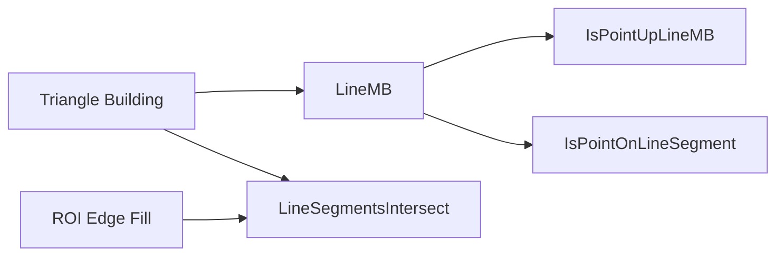

# Advanced Geometry and Neighborhood Operations – Line and Segment Geometry Utilities

This section describes **low-level geometric utilities** exposed by the `POINTSET` module. These functions handle line equations, point-line tests, segment-point containment, and segment-segment intersection. They power **triangle-building**, **ROI edge-filling**, and other **precise spatial analyses** within the Oiii application.

## Function Overview

- **LineMB** – Compute line slope (**m**) and intercept (**b**) for two points.
- **IsPointUpLineMB** – Test if a point lies  the line .
- **IsPointOnLineSegment** – Determine if a point lies  a given segment within configurable tolerances.
- **LineSegmentsIntersect** – Detect intersection of two line segments. Extended variant returns the intersection point.

## Function Reference

### LineMB

Computes the slope and intercept of the line passing through `(x1,y1)` and `(x2,y2)`.

**Prototype**

```cpp
int OIFIILIB_API LineMB(
    double x1, double y1, 
    double x2, double y2, 
    double* m, double* b
); // y = m*x + b
```

**Parameters**

| Name | Description |
| --- | --- |
| x1, y1 | Coordinates of first point |
| x2, y2 | Coordinates of second point |
| m | [out] Slope of the line |
| b | [out] Intercept (y-axis ordinate) |


**Return Value**

- `TRUE` if line equation successfully computed.
- `FALSE` if points are effectively vertical (adjusts `x1` slightly to avoid divide-by-zero).

The implementation uses

```cpp
m[0] = (y2 - y1)/(x2 - x1);
b[0] = y1 - m[0]*x1;
```

and guards against `x2 == x1` by nudging `x1` when needed .

---

### IsPointUpLineMB

Determines whether a point `(x,y)` lies  the line defined by `(m,b)`.

**Prototype**

```cpp
int OIFIILIB_API IsPointUpLineMB(
    double x, double y, 
    double* m, double* b
); // y = m*x + b
```

**Logic**

```cpp
double det = y - m[0]*x - b[0];
if      (det > 0) return TRUE;
else if (det < 0) return FALSE;
else             return FALSE; // on the line considered not “above”
```

This test is used to partition vertices left/right of a search path .

---

### IsPointOnLineSegment

Checks if point `(x,y)` lies on the segment between `(x1,y1)` and `(x2,y2)`, with optional tolerances.

**Prototype**

```cpp
int OIFIILIB_API IsPointOnLineSegment(
    double x1, double y1,
    double x2, double y2,
    double x,  double y,
    double x_res = 1.0,
    double y_res = 1.0
);
```

**Steps**

1. **Bounding-box test** with `x_res`/`y_res` margins.
2. Compute line `(m,b)` via `LineMB`.
3. Verify that the point’s y-value lies within `b ± m·x` tolerance.

Returns `TRUE` if the point is within the expanded box and on the mathematical line .

---

### LineSegmentsIntersect

Detects whether two line segments intersect. Two variants exist:

| Variant | Prototype | Returns |
| --- | --- | --- |
| **Boolean** | `BOOL LineSegmentsIntersect(double x1,y1,x2,y2, double x3,y3,x4,y4);` | `TRUE` if segments intersect within bounds. |
| **Extended** | `int OIFIILIB_API LineSegmentsIntersect(double x1,y1,x2,y2,double x3,y3,x4,y4, double* pfX, double* pfY);` | As above; also writes intersection point `(*pfX, *pfY)`. |


**Parametric Intersection**

- Solve for parameters `Ua` and `Ub` using cross-product formula.
- Reject if lines are **parallel** or **coincident** (`denominator == 0`).
- Intersection occurs within segments if `0 ≤ Ua ≤ 1` and `0 ≤ Ub ≤ 1`.

Implementation details and numerator/denominator calculations are from Poirier’s 2012 routine .

## Usage in Core Algorithms

These utilities are integrated deeply:

| Routine | Uses | References |
| --- | --- | --- |
| **Triangle Building** | `LineMB`, `IsPointUpLineMB`, `LineSegmentsIntersect` | Splitting search path into “up”/“down” vertices |
| **ROI Edge-Filling** | `LineSegmentsIntersect` | Collects boundary vertices across segments |




## Design Considerations

- **Numeric stability**: `LineMB` adds a tiny offset for vertical lines to avoid division by zero.
- **Configurable tolerance**: `IsPointOnLineSegment` accepts `x_res`/`y_res` to handle floating-point imprecision.
- **Parametric approach**: `LineSegmentsIntersect` uses a standard two-line parametric intersection ensuring efficiency and precision.

## Summary

The **Line and Segment Geometry Utilities** provide robust, reusable primitives for spatial queries. By centralizing slope/intercept computations, point-line classifications, and segment intersections, downstream routines—such as **Delaunay‐style triangle networks** and **edge extraction**—maintain clarity and accuracy.