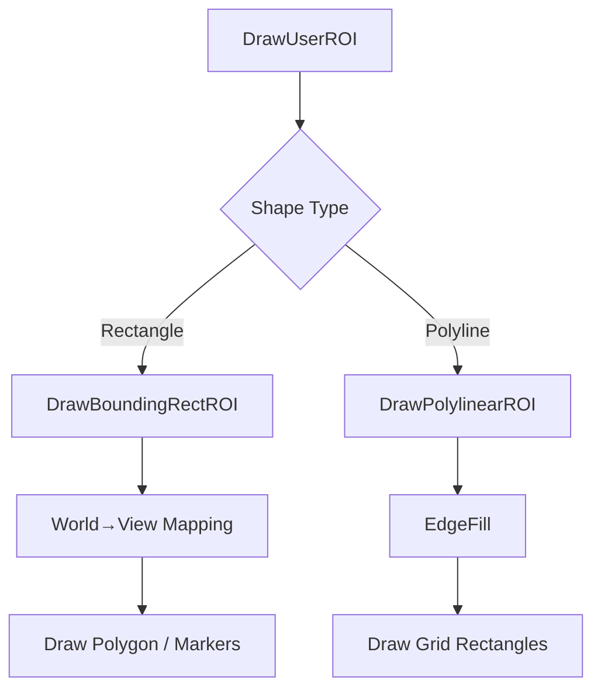

# Advanced Geometry and Neighborhood Operations – ROI Drawing and Grid-Based Edge Filling

This section covers two complementary subsystems in the Oifii toolkit that enhance Region of Interest (ROI) visualization and sampling:

- **Grid-Based Edge Filling** via the `EdgeFill()` functions
- **Bounding-Rectangle ROI Drawing** via `COWRoiset::DrawBoundingRectROI()`

Together, these routines allow users to render precise ROI boundaries and generate evenly-spaced sampling points along ROI edges, forming the basis for ROI-centric statistics and scatter plots.

---

## 🎯 EdgeFill Function

The `EdgeFill()` family computes all intermediate grid points along a line segment, enabling fine-grained sampling of ROI edges.

| Overload | Purpose |
| --- | --- |
| `int EdgeFill(POINT P1, POINT P2, POINT* pEdgePOINT, int npoint_max);` | Collects pixel-step points between P1 and P2. |
| `int EdgeFill(POINT P1, POINT P2, POINT* pEdgePOINT, int npoint_max, int iGridStep, …);` | Same as above with custom grid step and optional inner/outer edge arrays. |


**Key Parameters**

- **P1, P2**: Endpoints of the segment (device or world coords).
- **pEdgePOINT**: Caller-allocated array receiving intermediate points.
- **npoint_max**: Capacity of `pEdgePOINT`.
- **iGridStep**: (Optional) Grid resolution; defaults to 1 (pixel units).

**Return Value**

Number of points written into `pEdgePOINT`.

```cpp
// Basic usage: grid step of 1
const int MAX = 1000;
POINT collected[MAX];
int count = EdgeFill(startPt, endPt, collected, MAX);
```

---

## 📐 Grid-Based Point Rendering in ROIs

In `COWRoiset::DrawPolylinearROI()`, each polyline segment is:

1. Rendered as a simple polyline.
2. If the ROI is **selected**, `EdgeFill()` computes its grid points.
3. Those points are drawn as small rectangles, providing a visual grid overlay.

```cpp
// snippet from DrawPolylinearROI
if (iselected != ROISET_DRAWAS_NOTSELECTED) {
    for (int i = 0; i < npoints - 1; i++) {
        const int npoint_max = 1000;
        POINT pCollectedPOINT[npoint_max];
        int ncol = EdgeFill(pPOINT[i], pPOINT[i+1], pCollectedPOINT, npoint_max, 1);
        for (int j = 1; j < ncol - 1; j++) {
            pDC->Rectangle(
                pCollectedPOINT[j].x,
                pCollectedPOINT[j].y,
                pCollectedPOINT[j].x + iDX,
                pCollectedPOINT[j].y + iDY
            );
        }
    }
}
```

This grid filling enhances boundary refinement and underpins ROI-based data sampling .

---

## 🗔 COWRoiset::DrawBoundingRectROI()

`DrawBoundingRectROI()` computes and draws the bounding rectangle of a ROI polyline, adapting rendering to zoom and selection state.

### Responsibilities

- Compute world-coordinate corners from `POLYLINE->BoundingRect`.
- Map each corner to device/view coordinates using **COW2View**.
- Draw as polygon (border) or polyline.
- When **selected**, render corner markers scaled to current zoom.

```cpp
void COWRoiset::DrawBoundingRectROI(
    COW2View* pOW2View,
    CDC*      pDC,
    POLYLINE* pPOLYLINE,
    int       iselected,
    int       iborders
) {
    // Build world rect corners
    POINT2DD wp[4] = {
        { r.left,  r.top   },
        { r.right, r.top   },
        { r.right, r.bottom},
        { r.left,  r.bottom}
    };
    // Map to device coords
    CPoint vp[5];
    for (int i = 0; i < 4; i++) {
        vp[i] = pOW2View->MapPointFromWorldToView(wp[i]);
    }
    vp[4] = vp[0]; // close polygon

    if (iborders) {
        pDC->Polygon(vp, 5);
    }
    if (iselected == ROISET_DRAWAS_SELECTED) {
        // Adapt point size based on zoom
        CPoint z0(0,0), z1(1,1);
        pOW2View->OnPrepareDC(pDC);
        pDC->LPtoDP(&z0); pDC->LPtoDP(&z1);
        CSize unit = CSize(z1.x - z0.x, z1.y - z0.y);
        int markerSize = 4 - (int)(sqrt(unit.cx) + 1.0);
        // Draw corner markers...
    }
}
```

**Flow**

1. **Validation**: Ensure non-null `pOW2View`, `pDC`, `pPOLYLINE`.
2. **World→View** mapping via `COW2View::MapPointFromWorldToView`.
3. **Border** rendering as polygon (`pDC->Polygon`).
4. **Selection** mode draws scaled corner markers .

---

## 🔗 Integration Workflow

1. **User action** selects or edits a ROI.
2. **DrawUserROI** iterates ROI list and calls:
3. `DrawRectangularROI()` → `DrawBoundingRectROI(…, iborders=TRUE)`.
4. `DrawPolylinearROI()` → polyline + grid fill + bounding rect.
5. The **CDC** (device context) receives all draw commands, synchronized with zoom transforms in **COW2View**.



---

## ⚙️ Dependencies & Key Types

| Component | Role |
| --- | --- |
| **COWRoiset** | Manages ROI vector overlay; extends COWEdgeset. |
| **COWEdgeset** | Provides generic edge/vertex operations. |
| **COW2View** | Handles world↔view coordinate transformations. |
| **CDC** | MFC device context for drawing primitives. |
| **POLYLINE** | Holds vertex list and bounding rect of ROI. |
| **POINT2DD** | Double precision world coordinates. |


---

```card
{
    "title": "Buffer Allocation",
    "content": "Ensure pEdgePOINT arrays in EdgeFill have sufficient size (e.g., \u2265 max segment length)."
}
```

---

## 🎉 Summary

The **EdgeFill** routines and **DrawBoundingRectROI** method form the backbone of advanced ROI visualization in Oifii. They enable:

- Precise edge sampling for data analysis.
- Adaptive visualization of ROI boundaries under zoom and selection.
- A unified workflow where user-drawn shapes translate into device-rendered primitives and sampling grids.

By understanding these components, developers can customize ROI rendering, integrate ROI-based statistics, and extend the toolkit for novel scientific workflows.