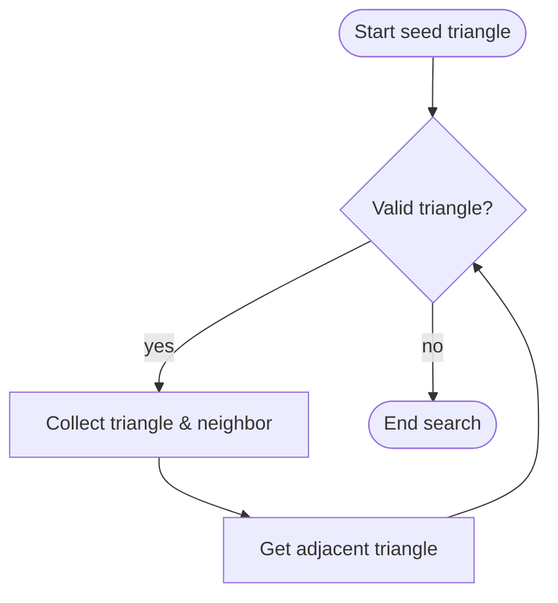

# Advanced Geometry and Neighborhood Operations – Triangle Networks and Neighbor Searches 🔺

This section delves into the **POINTSET** library’s routines for traversing and querying triangulated meshes. These functions enable robust discovery of triangles and neighbor vertices around a point, handle invalid triangles and boundary cases, and underpin Voronoi‐based computations, neighborhood statistics, and edge‐filling operations in ROI analyses.

## Key Functions Overview

| Function | Purpose | Return Values |
| --- | --- | --- |
| **FindAllTriSurroundingVertex** | Discovers all triangles and neighboring vertices around a vertex. | `1` (success), `0` (found invalid), `<0` (error) |
| **FindAllValidTriSurroundingVertex** | Retrieves only valid triangles and neighbors in clockwise order. | `1` (all valid), `0` (hit boundary), `<0` (error) |
| **GetAdjTri** | Finds the triangle adjacent to a given triangle across an edge. | Triangle index or `-1` if none |
| **InvalidTri** | Checks if a triangle lies outside the convex envelope or is invalid. | `TRUE` (invalid), `FALSE` (valid) |


---

## FindAllTriSurroundingVertex

This routine performs a counter‐clockwise sweep around a specified vertex to collect every incident triangle and its opposite neighbor vertex. It starts from a “seed” triangle, iteratively calls **GetAdjTri**, and stops when it either returns to the start or encounters an **InvalidTri**.

```c
int OIFIILIB_API FindAllTriSurroundingVertex(
    POINTSET* pPointset,
    int       ivertex,
    int*      p_itriseed,
    int*      p_numtrifound,
    int*      p_arraytri,
    int*      p_arrayneighbor
);
```

- **ivertex**: Index of the target vertex.
- **p_itriseed**: Pointer to the starting triangle index; updated to last valid upon early termination.
- **p_numtrifound**: Number of triangles found (output).
- **p_arraytri**, **p_arrayneighbor**: Arrays to receive triangle and neighbor‐vertex indices.

This function returns `1` on full success, `0` if an invalid triangle is encountered (allowing fallback search), or negative on error .

---

## FindAllValidTriSurroundingVertex

A safer variation that skips invalid triangles and collects only those fully inside the convex hull. It performs an initial counter‐clockwise search to locate a valid triangle, then proceeds clockwise to build a consistent list of valid triangles and neighbor vertices in ascending angular order.

```c
int OIFIILIB_API FindAllValidTriSurroundingVertex(
    POINTSET* pPointset,
    int       ivertex,
    int*      p_itriseed,
    int*      p_numtrifound,
    int*      p_arraytri,
    int*      p_numneighborfound,
    int*      p_arrayneighbor
);
```

- Returns `TRUE` if all surrounding triangles are valid (interior vertex).
- Returns `FALSE` if the vertex lies on the convex hull (boundary) or an error code if pointers are null .

---

## GetAdjTri

Retrieves the index of the triangle sharing the edge defined by two vertices, excluding the current triangle. This is the workhorse for mesh traversal.

```c
int OIFIILIB_API GetAdjTri(
    POINTSET* pPointset,
    int       vertex1,
    int       vertex2,
    int       currentTri
);
```

- **vertex1**, **vertex2**: Indices defining the common edge.
- **currentTri**: The triangle to step away from.
- Returns the adjacent triangle index or `-1` if no neighbor exists .

---

## InvalidTri

Determines whether a triangle is “invalid” by checking if its geometric center lies outside the convex envelope defined by axis‐aligned bounds. Used to detect boundary crossings and skip degenerate triangles.

```c
int OIFIILIB_API InvalidTri(
    POINTSET* pPointset,
    int       itri
);
```

- **itri**: Triangle index to test.
- Returns `TRUE` if the triangle center is outside `[xmin, xmax]×[ymin, ymax]`, else `FALSE` .

---

## Workflow Diagram

The following flowchart illustrates how **FindAllTriSurroundingVertex** orchestrates mesh traversal:



---

## Integration and Applications

- **Voronoi Area & Density**

Both valid and full neighbor searches feed into `ComputeVoronoiAreaForVertex` and `ComputeVoronoiAreaForAllVertex`, where triangle centers form the polygon for area computation .

- **Neighborhood Statistics**

Functions like `ComputeNeighboringVoronoiDensityForAllVertex`, `ComputeLocalAverage`, and `ComputeLocalVariance` rely on consistent neighbor lists built via these routines to produce robust ROI‐based metrics .

- **Edge‐Filling Operations**

In segment‐based analyses, `InitializeListNeighbor` uses `FindAllValidTriSurroundingVertex` to build neighbor lists per segment for morphological operations and fusion tasks .

These capabilities form the geometric backbone of the Oiii toolkit, enabling advanced point‐set processing, visualization, and analysis on triangulated data.