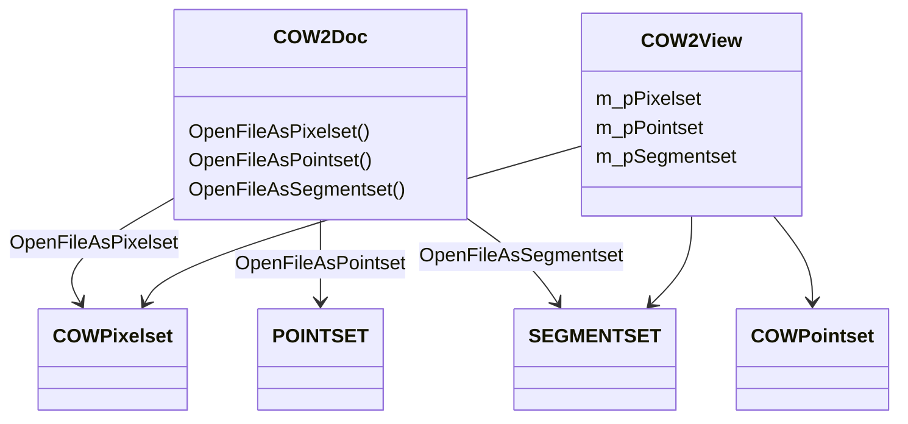

# Core Concepts: Data Sets, Views, and Documents

This section explains the fundamental data sets in Oiii: how they’re represented, stored, and accessed. We focus on three scientific data set types—**Pixel**, **Point**, and **Segment** sets—and their roles within the document/view architecture.

---

## Data Set Types: Pixel, Point, and Segment Sets

Oiii revolves around three core data set types. Each type encapsulates distinct scientific primitives and is accessed via specialized C structures and C++ wrapper classes.

| Data Set Type | Representation | Primary Use |
| --- | --- | --- |
| Pixel set | `COWPixelset` | Raster images and regions of interest (ROIs) |
| Point set | `POINTSET` struct | Collections of 2D points, triangulations, per-point stats |
| Segment set | `SEGMENTSET` struct | Clusters of points (segments), neighbor/fusion analysis |


---

## Pixel Sets 📷

Pixel sets store raster-image data, often multi-channel, and support region-based access via AccuSoft DIB/ROI routines.

**Key Components**

- **COWPixelset**: C++ class for pixel data and metadata
- **View Integration**: `COW2View` holds `m_pPixelset` to render or process pixels
- **I/O in Document**:
- `OpenFileAsPixelset` / `SaveFileAsPixelset` in `COW2Doc`

**AccuSoft DIB Access Routines**

| Function | Purpose |
| --- | --- |
| `col_get` | Read a column of pixels via an `LPSEGMENT` |
| `col_set` | Write a column of pixels via an `LPSEGMENT` |
| `row8_get` | Retrieve an 8-bit row defined by `LPSEGMENT` |
| `row8_set` | Set an 8-bit row defined by `LPSEGMENT` |
| `row24r_set` | Set red channel of 24-bit row |
| `row24g_set` | Set green channel of 24-bit row |
| `row24b_set` | Set blue channel of 24-bit row |


```c
// Example: writing a column segment to image
SEGMENT segment = { x:0, y:0, length:100 };
PIXEL array[256];
col_set(image, &segment, array);
```

---

## Point Sets 📍

Point sets capture discrete 2D coordinates, build triangulations, and compute per-point statistics (e.g., Voronoi areas).

### Core Structure

```c
typedef struct tagPOINTSET {
    int    npts;            // Number of points
    double *px, *py;        // Arrays of X, Y coordinates
    int    *dcd;            // Optional classification codes
    double *pfStatistics;   // Per-point statistics array
    int    nStatPerPoint;   // Number of stats per point
    double xmin, xmax, ymin, ymax; // Bounding rectangle
    long   maxnumberofelements;
    char   filename[255];
} POINTSET;
```

(Fields excerpted from pointset.h)

### C++ Wrapper: `COWPointset`

Provides methods to manage and visualize point sets:

- **Construction & Destruction**
- `NewPointset(maxelements)` / `DeletePointset(p)`
- **Network & Statistics**
- `BuildTriangleNetwork(pPointset)`
- `ComputeVoronoiAreaForAllVertex(pPointset)`
- `ComputeLocalVariance(pPointset, …)`
- `ComputeGlobalAverage(pPointset, statOffset)`
- **Queries & Neighbors**
- `FindNearestNeighbor(pPointset, x, y, …)`
- `FindAllNeighborSurroundingVertex(pPointset, vertex, order, …)`
- `IsTriangleStoredCounterClockwise(pPointset, triID)`

### Visualization Flags

Bitmasks control rendering in `COWPointset::DrawPointset`:

- `POINTSET_DRAW_POINTSET_AS_ELLIPSE`
- `POINTSET_DRAW_POINTSET_AS_CROSS`
- `POINTSET_DRAW_LABELS`
- `POINTSET_DRAW_TRIANGLESET_AS_POLYGON`
- …and more

---

## Segment Sets 🔗

Segments group adjacent points into clusters and support hierarchical fusion.

### Core Structure

```c
typedef struct tagSEGMENTSET {
    SEGMENT *pListSegment;   // All segments
    NEIGHBOR *pListNeighbor; // Adjacent segment IDs
    FUSION   *pListFusion;   // Fusion history
    double   *pfStatistics;  // Per-segment stats
    int      nStatPerSegment;
    int      iInitialNumberOfSegment;
    int      iActualNumberOfSegment;
    int      iFinalNumberOfSegment;
    int      iActualNumberOfNeighbor;
    int      iActualNumberOfFusion;
    int      idneiNextAvailNeighbor;
} SEGMENTSET;
```

(from segset.h)

### Lifecycle Functions

- **Allocation & Cleanup**
- `NewSegmentSet(initCount, finalCount)`
- `DeleteSegmentSet(pSegmentSet)`
- **Initialization**
- `InitializeSegmentSet(pSegmentSet, pPointset)`
- Invokes `InitializeSegmentStatistics` and `InitializeListNeighbor`
- **Fusion**
- `BuildFusionTree(pSegmentSet)` builds hierarchical mergers

### View Integration

`COW2View` drawing routines accept `POINTSET*` and `SEGMENTSET*`:

```cpp
void DrawSegmentPolygon(
    CDC* pDC,
    POINTSET* pPointset,
    SEGMENTSET* pSegmentset,
    int idsegment,
    int idvertex,
    int finalPartition,
    BOOL bSelectPen = TRUE);
```

(Defined in view header)

---

## Data Set Architecture Diagram



---

> **Key Takeaway** Each data set type exposes low-level C structures for performance and high-level C++ wrappers for ease of use. They interoperate tightly with the view/document framework to support scientific processing, analysis, and visualization.