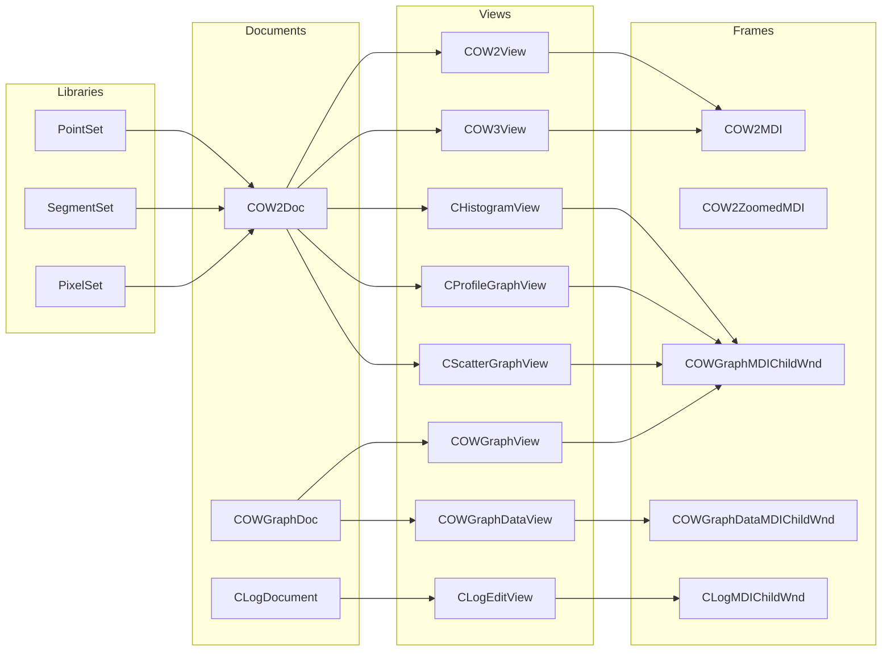

# Core Concepts: Data Sets, Views, and Documents

In Oiii’s document/view architecture, **documents** encapsulate application data, **views** render and interact with that data, and **MDI frames** host views. Data flows from low-level libraries (e.g. point-set, segment-set, pixel-set) into documents, and then into views for visualization and user interaction.

## Documents 📄

Documents manage in-memory representations of data sets. They own the core data structures and provide serialization, settings, and logging.

| Document Class | Purpose | Key Data Members |
| --- | --- | --- |
| **COW2Doc** | 2D world document: holds pixel, point, segment, ROI, class sets | `m_pPixelset`, `m_pPointset`, `m_pSegmentset`, `m_pROIset` |
| **CLogDocument** | Textual log of operations and errors | `m_BufferString` (in-memory log buffer) |
| **COWGraphDoc** | Graph data container: holds multiple GraphSet objects | `m_GraphSetList`, axis labels, graph type |


### Document Registration

Documents and their associated view/frame classes are linked via `COWMultiDocTemplate` in the application initialization:

```cpp
// In COIIIApp::InitInstance()
m_pOW2DocTemplate = new COWMultiDocTemplate(
    IDR_COMMON,
    RUNTIME_CLASS(COW2Doc),
    RUNTIME_CLASS(COW2MDI),
    RUNTIME_CLASS(COW2View)
);
AddDocTemplate(m_pOW2DocTemplate);
```

This pattern repeats for log and graph documents .

## Views 👀

Views render document data using MFC’s view classes. Each view interprets document data in a specific way.

| View Class | Base Class | Renders | Source Header |
| --- | --- | --- | --- |
| **COW2View** | COWView | 2D world data (pixels, points, segments) | `Ow2view.h` |
| **COW3View** | COWView | 3D OpenGL visualization | `Ow3view.h` |
| **CHistogramView** | COWGraphView | Histogram (bar chart) | `owgl_histovw.h` |
| **CProfileGraphView** | COWGraphView | Profile (line chart) | `owgl_profilevw.h` |
| **CScatterGraphView** | COWGraphView | Scatter plot | `owgl_scattervw.h` |
| **COWGraphView** | CScrollView | Core graph rendering (lines, bars, grids) | `graphvw.h` |
| **COWGraphDataView** | CEditView | Tabular graph data (clipboard export) | `gl_dataview.cpp` |
| **CLogEditView** | CEditView | Textual log display | `Logview.h` |


## MDI Frames 🖥️

> **Note:** Most graph views bypass `OnInitialUpdate` to control sizing manually, then rely on document templates to create frames and views on demand.

MDI child frames host view instances and manage window layout (status bars, docking, resizing).

| Frame Class | Hosts View | Description |
| --- | --- | --- |
| **COW2MDI** | COW2View / COW3View | Standard 2D/3D child frame |
| **COW2ZoomedMDI** | COW2ZoomedView | Zoomed 2D view |
| **CLogMDIChildWnd** | CLogEditView | Log window |
| **COWGraphMDIChildWnd** | COWGraphView | Graph display with status bar |
| **COWGraphDataMDIChildWnd** | COWGraphDataView | Data table window |


## Data Flow 🔄



This flowchart illustrates how low-level data sets feed into document objects, which in turn connect to specific view classes. Views are hosted in MDI frames.

## Key Patterns and Responsibilities

- **Runtime Creation:** Views and documents derive from `DECLARE_DYNCREATE` for dynamic creation via `CRuntimeClass`.
- **Template Binding:** `COWMultiDocTemplate` binds document, frame, and view classes.
- **Separation of Concerns:** Documents handle data logic and I/O; views handle rendering and user interaction; frames manage windowing.
- **Graph Library Integration:** `COWGraphDoc` and its views leverage AccuSoft Pro Imaging Toolkit for flexible charting .

---

```card
{
    "title": "Tip",
    "content": "Keep document logic free of UI code; let views handle rendering."
}
```

> **Card Block**

This section outlines the core architecture for Oiii’s document/view system, detailing how data sets propagate through documents into specialized views and frames for visualization and interaction.