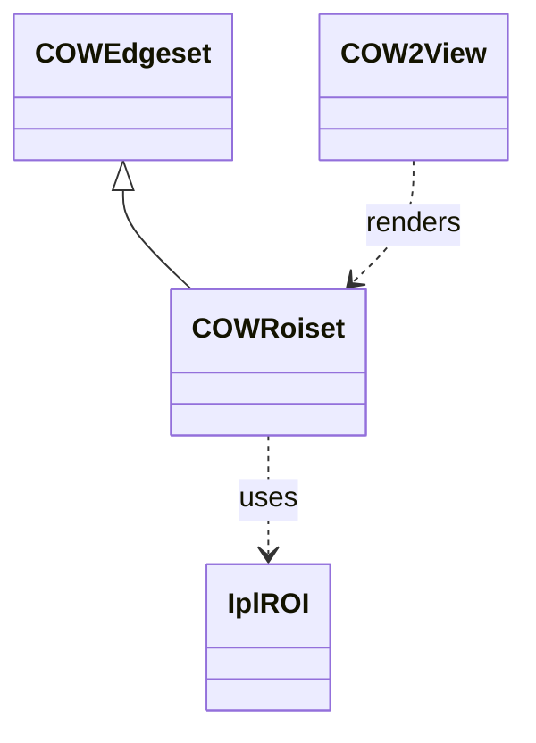

# Core Concepts: Data Sets, Views, and Documents – Regions of Interest (ROI) and ROI Sets

Regions of Interest (ROIs) define subareas of images or data for targeted processing. In Oiii, ROIs are built on top of the AccuSoft Pro Imaging Toolkit’s ROI structures and routines. The **COWRoiset** class then layers vector‐based management and rendering within 2D views.

## What Is an ROI? 🎯

A Region of Interest (ROI) describes an arbitrary shape within an image for focused operations like statistics or filtering.

- Internally, AccuSoft uses the `IplROI` handle to manage ROI geometry and clipping.
- The ROI is represented as a collection of segments (scanlines) or geometric primitives (rectangle, circle).
- Segments are raster rows defined by (x, y, length) triples, clipped by an internal rectangle.

## AccuSoft Pro Imaging Toolkit – Core ROI Functions

The Toolkit exposes a rich set of `ROI_` functions for allocation, geometry, and analysis.

| Function | Description |
| --- | --- |
| `iplCreateROI(coi, x, y, w, h)` | Allocate a rectangular ROI of size w×h at offset (x,y). |
| `iplSetROI(roi*, coi, x, y, w, h)` | Modify an existing ROI’s channel, offset, and dimensions. |
| `iplDeleteROI(roi*)` | Free ROI structure and clear its handle. |
| `ROI_union(src, dst)` | Compute the union of two ROIs into dst. |
| `ROI_intersect(src, dst)` | Compute the intersection of two ROIs into dst. |
| `ROI_clip_rect_get/set` | Get or set the ROI’s clipping rectangle. |
| `ROI_number_of_segments(roi)` | Return number of scanline segments in roi. |
| `ROI_first_segment_get(roi,s)` | Retrieve the first segment from roi. |
| `ROI_next_segment_get(roi,s)` | Retrieve subsequent segments, invoking any status callbacks. |
| `ROI_statistics_get(roi,stats*)` | Compute pixel‐wise statistics (min, max, mean) over roi. |


## COWRoiset – Vectorial ROI Management in Oiii

Oiii wraps the Toolkit’s ROI primitives into a **vector overlay** for interactive selection, editing, and rendering in 2D views.

### Class Definition

```cpp
class OIFIILIB_API COWRoiset : public COWEdgeset {
protected:
    int   m_idroi_selected;  // ID of currently selected ROI
    CPtrList* m_pListROI;    // List of POLYLINE objects
public:
    COWRoiset();
    ~COWRoiset();
    void DefaultInitialization();
    BOOL ReadAllValuesFrom(FILE*);
    BOOL WriteAllValuesTo(FILE*);
    int  AddRectangularROI(RECT* pRect);
    int  AddRectangularROI(double x1,double y1,double x2,double y2);
    int  AddPolylinearROI(RECT* pRect,int dx=1,int dy=1);
    int  AddLineToPolylinearROI(int id,RECT* pRect,int dx=1,int dy=1);
    BOOL DeleteROI(int id);
    int  GetNumberOfUserROI();
    int  GetNumberOfROI();
    int  ModifyRectangularROI(int id,RECT* pRect);
    int  TranslateRectangularROI(int id,int dx,int dy);
    int  SelectROI(int id);
    RECT GetRectROI(int id);
    POLYLINE* GetInfoROI(int id);
    int  IsTouchingROI(CPoint pt);
    void DrawUserROI(COW2View* pV,CDC* pDC,int id=ROISET_ALL,int sel=ROISET_DRAWAS_NOTSELECTED);
    // ...
    void DrawBoundingRectROI(COW2View* pV,CDC* pDC,POLYLINE* pl,int sel,int borders=TRUE);
};
```

This declaration shows how **COWRoiset** inherits from **COWEdgeset** and exposes methods to create, modify, select, and render ROIs .

### Default Initialization 📐

The constructor seeds four default ROIs for world and view boundaries:

1. Smallest world rect
2. Largest world rect
3. User view rectangle
4. Selection rectangle

```cpp
COWRoiset::DefaultInitialization() {
    m_pListROI      = &m_ListPOLYLINE;
    m_idroi_selected = EDGESET_VIEWING_RECT_ROI_ID;
}
```

These defaults support consistent coordinate mappings.

### Core Methods Overview

| Method | Purpose |
| --- | --- |
| AddRectangularROI | Construct axis‐aligned ROI polygon from a RECT. |
| AddPolylinearROI / AddLineToPoly… | Build free‐form ROI by adding line segments. |
| DeleteROI | Remove ROI by its identifier. |
| GetNumberOfROI / GetNumberOfUserROI | Query total or user‐defined ROI count. |
| SelectROI / GetSelectedROI | Highlight and retrieve the active ROI. |
| DrawUserROI | Delegate to rectangle or polyline drawing routines. |


### Rendering and Grid Point Computation

When drawing a poly‐ROI, **COWRoiset** can compute interior grid points for visualization or auxiliary analysis:

```cpp
// Inside DrawPolylinearROI:
POINT pCollected[1000];
int ncol = EdgeFill(p1,p2,pCollected,1000,1);
for(int j=1; j<ncol-1; j++) {
    pDC->Rectangle(pCollected[j].x, pCollected[j].y,
                   pCollected[j].x+dx, pCollected[j].y+dy);
}
DrawBoundingRectROI(pV,pDC,pPOLYLINE,sel, borders);
```

This leverages **EdgeFill** (grid‐neighbor sampling) to enumerate pixel‐center points along edges .

### Mapping Between World and View Coordinates

Coordinate transformation is handled by **COW2View**:

- `MapPointFromWorldToView(POINT2DD)` converts geometric (world) points to device (view) points.
- `MapPointFromViewToWorld(POINT)` performs the inverse.

In `DrawBoundingRectROI`, world‐space corners are mapped before rendering .

### Integration with Documents and Views

- **COW2Doc** loads and saves ROI sets via `OpenFileAsRoiset` and `SaveFileAsRoiset` .
- **COW2View** responds to user commands (`ID_ROI_RECT`, `ID_ROI_POLYLINE`, etc.) by enabling ROI drawing modes and invalidating the view to trigger repaint.

## Focused Analysis with ROIs 🔍

Once defined, ROIs can restrict operations to their regions. For example, histogram tabulation within an ROI:

```cpp
histo_tabulate(image, lpHisto, roi, 1);
```

Here, only pixels inside `roi` are counted.

## Design Patterns and Relationships



- **Inheritance**: `COWRoiset` extends `COWEdgeset` to manage polygonal overlays.
- **Composition**: It holds `POLYLINE` lists wrapping `IplROI` geometry.
- **Separation**: AccuSoft handles low‐level pixel access; Oiii handles user‐interface and vector rendering.

```card
{
    "title": "Memory Management",
    "content": "Always free AccuSoft ROIs with iplDeleteROI and remove COWRoiset entries via DeleteROI to prevent resource leaks."
}
```

This section covers how ROIs and ROI sets are defined, manipulated, and visualized within Oiii, building on AccuSoft’s Pro Imaging Toolkit for robust scientific analysis.