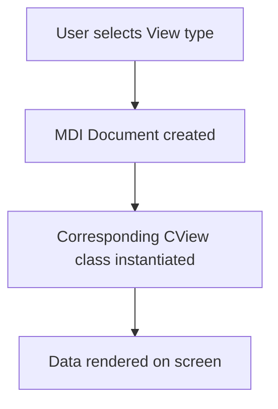

# Getting Started with the Oiii Application – High-Level User Workflow

This guide outlines a typical end-user workflow in **Oiii.exe**, from importing data sets to viewing and analyzing results. Follow these five major steps to get up and running quickly.

## Step 1: Load or Create a Data Set 📂

Begin by importing or acquiring your raw data (pixels or points), often tied to an image via the AccuSoft libraries.

- **File → Open…** (`ID_FILE_OPEN`): load an existing image or project into a new document .
- **File → Acquire…** (`ID_FILE_ACQUIRE`): capture a live image from a connected device .

**Code Snippet**

```cpp
// In COIIIApp message map
ON_COMMAND(ID_FILE_OPEN, OnFileOpen)
ON_COMMAND(ID_FILE_ACQUIRE, OnFileAcquire)

// Handler in main frame
void CMainFrame::OnFileOpen() {
    // pops standard file open dialog
    CWinApp::OnFileOpen();
}
```

| Action | Menu Path | Command ID |
| --- | --- | --- |
| Load image | File → Open… | ID_FILE_OPEN |
| Acquire image | File → Acquire… | ID_FILE_ACQUIRE |


## Step 2: Visualize the Data 📊

Oiii provides multiple view types to explore your data in 2D, 3D and statistical formats.

- **2D View** – **View → New 2DView** (`ID_VIEW_NEW2DVIEW`) opens a `COW2View` inside an `COW2Doc` document .
- **3D View** – **View → New 3DView** (`ID_VIEW_NEW3DVIEW`) uses `COW3View` for three-dimensional rendering .
- **Graph View** – **View → New GraphView** (`ID_VIEW_NEWGRAPHVIEW`) creates a `COWGraphView` under a `COWGraphDoc` .
- **Data View** – **View → New DataView** (`ID_VIEW_GRAPHDATAVIEW`) shows raw statistics in a `COWGraphDataView` text editor .
- **Zoom View** – **View → New ZoomView** (`ID_VIEW_NEWSELECTIONZOOMVIEW`) for focused ROI inspection.

**Architecture**



Document templates are registered in `COIIIApp::InitInstance`, mapping each `RUNTIME_CLASS` to its MDI child and view .

## Step 3: Configure Analysis Parameters ⚙️

Before running routines, adjust settings for extraction, histogramming, scatter plotting, fusion, classification, projection and transformation.

- Open the **Settings** menu:
- **Extraction** – `ID_SETTINGS_EXTRACTION`
- **Profile** – `ID_SETTINGS_PROFILE`
- **Histogram** – `ID_SETTINGS_HISTO`
- **Scatter graph** – `ID_SETTINGS_SCATTER`
- **Fusion** – `ID_SETTINGS_FUSION`
- **Classification** – `ID_SETTINGS_CLASSIFICATION`
- **Mapping** – `ID_SETTINGS_VIEWDATA`
- **Projection** – `ID_SETTINGS_PROJECTION`
- **Transformation** – `ID_SETTINGS_TRANSFORMATION`
- **Mouse Behavior** – `ID_SETTINGS_IDLEBEHAVIOR`
- **Trace Behavior** – `ID_SETTINGS_TRACEBEHAVIOR` .

These commands display a **property sheet** (`CSettingsSheet`) with pages (`CExtractionSettings`, `CHistoPage`, etc.). Handlers in `COIIIApp` select the active page then show the sheet .

## Step 4: Run Segmentation & Analysis Routines 🚀

Execute global or local analysis via the **Analysis** menu:

- **Global Extraction** – `ID_ANALYSIS_TEXTUREEXTRACTION`
- **Global Segmentation** – `ID_ANALYSIS_TEXTURESEGMENTATION`
- **Global Classification** – `ID_ANALYSIS_GLOBALCLASSIFICATION`
- **Local Extraction** – `ID_ANALYSIS_LOCALEXTRACTION`
- **Local Segmentation** – `ID_ANALYSIS_LOCALSEGMENTATION`
- **Local Classification** – `ID_ANALYSIS_LOCALCLASSIFICATION`
- **Scale Selection** – `ID_ANALYSIS_SCALE_SELECTION`
- **Launch Scenario** – `ID_ANALYSIS_LAUNCHSCENARIO` .

Under the hood, `COW2View` routes commands to `COW2Doc::OnAnalysisTextureextraction()`, which logs progress in `CLogDocument`, builds a `POINTSET`, allocates a `SEGMENTSET`, initializes it, and constructs a **fusion tree** via C library calls (e.g., `NewSegmentSet`, `InitializeSegmentSet`, `BuildFusionTree`) .

## Step 5: Inspect Quantitative & Qualitative Results 🔍

Review outputs in graphical and log views:

- **Graph Views** display histograms, profiles, and scatter plots with multiple `COWGraphSet` channels.
- **Data Views** show tab-delimited statistics via `COWGraphDataView` (a subclass of `CEditView`) .
- **Log Window** – **View → Log Window** (`ID_VIEW_LOGWINDOW`) reveals `CLogView` linked to `CLogDocument` for textual reports and debug dumps .

Results can be copied to the clipboard or exported via menu commands. Use `COWGraphDoc::CopyGraphSetsToClipboardVerticaly()` or log commands (`OnEditCopy`) as needed.

---

By following these steps, new users can quickly load data, visualize structures, fine-tune analysis parameters, execute advanced segmentation/classification routines, and examine both numerical and visual outputs within the Oiii environment.