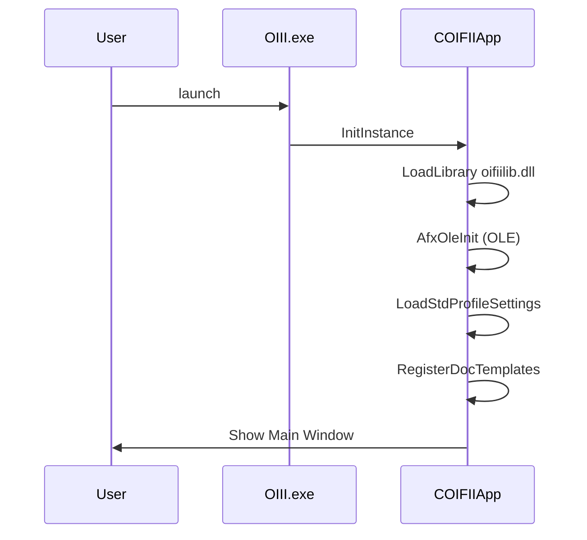

# Getting Started with the Oiii Application – Running Oiii

This section guides you through launching the Oiii desktop application after building the solution. You’ll learn where to find the executable, how the application initializes its core components, and how to open the main visualization and analysis views.

## Prerequisites

- **Successful Build**: Compile the `OIII` project in either Debug or Release mode.
- **Output Directories**
- Debug build → `WinDebug`
- Release build → `WinRel`
- **Dependencies**
- Ensure `oifiilib.dll` is present alongside `OIII.exe` (loaded at startup)

## Launching the Application 🚀

1. Open a command prompt or File Explorer.
2. Change to the build output directory:

```bash
   cd path\to\oifii_vs2026u\WinDebug
```

1. Run the executable:

```bash
   OIII.exe
```

Or, for a Release build:

```bash
   cd path\to\oifii_vs2026u\WinRel
   OIII.exe
```

```card
{
    "title": "DLL Dependency",
    "content": "Ensure oifiilib.dll is in the same directory as OIII.exe before running."
}
```

## Initialization Sequence

> **Note:** The Debug build (`WinDebug`) includes full symbolic information, while the Release build (`WinRel`) is optimized for performance.

Upon launch, `COIFIIApp::InitInstance` initializes the application.



| Step | Component | Description |
| --- | --- | --- |
| 1 | LoadLibrary (oifiilib.dll) | Sets the resource handle for UI assets |
| 2 | AfxOleInit | Initializes OLE libraries for drag-drop and clipboard support |
| 3 | LoadStdProfileSettings | Loads INI-style settings, including MRU list |
| 4 | RegisterDocTemplates | Registers MDI templates for 2D, 3D, Graph, Data, Zoom views |


## Exploring the User Interface 🖥️

Once the main window appears, you’ll see the standard MFC UI:

- **Menu Bar**: Access File, View, Analysis, Settings, Window, Help.
- **Toolbar**: Toggle via View → Toolbar.
- **Status Bar**: Toggle via View → Status Bar.

### Available Views

- **2D View** – Opens a 2D world document (ID_VIEW_NEW2DVIEW)
- **3D View** – Renders 3D visualization (ID_VIEW_NEW3DVIEW)
- **Graph View** – Displays charts and graphs (ID_VIEW_NEWGRAPHVIEW)
- **Data View** – Tabular data display (ID_VIEW_GRAPHDATAVIEW)
- **Zoom View** – Interactive zoom selection (ID_VIEW_NEWSELECTIONZOOMVIEW)

### Opening a New View

- Via **Menu**
- Go to **View** ➜ **New 2DView**, **New 3DView**, etc.
- Via **Toolbar**
- Click the corresponding icon (hover text shows the command ID).

## Performing Basic Operations

1. **Open a File**
2. **File** → **Open** (Ctrl+O)
3. **Automatic File Type Detection**
4. `.ow2` → 2D World Document
5. Pixelset → loaded as a pixel dataset
6. Pointset → builds TIN & computes statistics
7. Segmentset, Classset, ROI → appropriate view

1. **Save**
2. **File** → **Save** / **Save As** (Ctrl+S)

## Analysis Tools 🔍

Under the **Analysis** menu, you can invoke specialized processing commands:

- **Texture Extraction** (ID_ANALYSIS_TEXTUREEXTRACTION)
- **Texture Segmentation** (ID_ANALYSIS_TEXTURESEGMENTATION)

These commands act on the active view’s dataset and generate results in new views or log entries.

## Configuring Analysis Settings

Fine-tune behavior via the **Settings** menu:

| Category | Command ID |
| --- | --- |
| **Scatter** | ID_SETTINGS_SCATTER |
| **Fusion** | ID_SETTINGS_FUSION |
| **Classification** | ID_SETTINGS_CLASSIFICATION |
| **Mapping** | ID_SETTINGS_VIEWDATA |
| **Projection** | ID_SETTINGS_PROJECTION |
| **Transformation** | ID_SETTINGS_TRANSFORMATION |
| **Mouse Behavior** | ID_SETTINGS_IDLEBEHAVIOR |
| **Trace Behavior** | ID_SETTINGS_TRACEBEHAVIOR |


## Inspecting Logs 📜

Oiii maintains an internal log document (`CLogDocument`):

- **Log View**: Access via **View** ➜ **Log View** (if enabled).
- **Log Contents**: Shows file-open messages, errors, and processing steps.

---

With these steps, you’re ready to launch Oiii, explore its core views, perform analyses, and inspect logs. Enjoy visualizing and processing your scientific datasets!