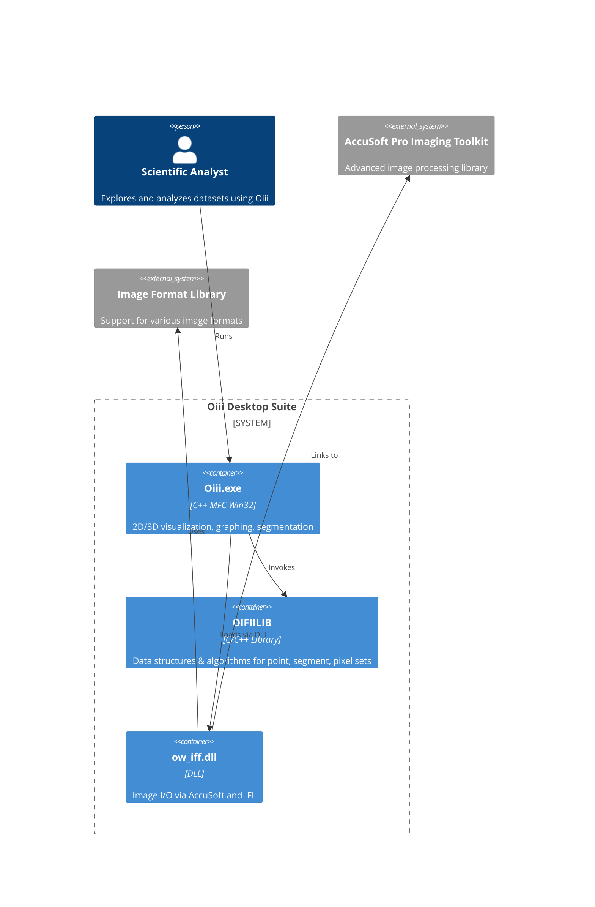

# Getting Started with the Oiii Application

Welcome to the **Oiii** desktop toolkit—a powerful Win32/MFC application for scientific data visualization and analysis. In this section, you’ll learn **what Oiii is**, its **core components**, and how to **build and launch** the application.

---

## What is Oiii? 🧐

Oiii.exe is the primary Windows desktop application in this repository. It is an MFC-style Win32 program offering:

- **2D/3D visualization** of point, segment, and pixel sets
- **Graphing** (bar, line) and **scatter plots**
- **Segmentation** and **analysis** tools over scientific datasets
- Integration with C/C++ libraries and imaging toolkits

Built from dozens of C++ source files into a single Win32 I386 executable, Oiii provides an interactive GUI for scientific workflows .

---

## Key Features

- 🖼️ **Visualization**: Render pixelsets, pointsets, segments in 2D & 3D.
- 📊 **Graphing & Plots**: Create bar charts, line graphs, and scatter views.
- ✂️ **Segmentation Tools**: Generate and refine segment, fusion, partition sets.
- 🔍 **Analysis Modules**: Compute statistics, edge-detect, flat-detect, HSI transforms.
- ⚙️ **Extensibility**: Plug in external libraries (AccuSoft, FreeImage, OW_IFF).

---

## Core Components

| Component | Role |
| --- | --- |
| **Oiii.exe** | Main Win32/MFC application; orchestrates UI, document templates, and tool integrations |
| **OIFIILIB** | C/C++ library housing data structures (pointset, segmentset, pixelset) and algorithms |
| **ow_iff.dll** | Image-format DLL wrapping AccuSoft Pro Imaging Toolkit and Image Format Library for raster I/O |
| **AccuSoft** | External Pro Imaging Toolkit (linked via `accuimr5.lib`) for advanced image processing |
| **OpenGL** | Provides hardware-accelerated rendering of 3D scenes (`opengl32.lib`, `glu32.lib`) |


---

## Source Structure

Below are the **primary source files** used to build `Oiii.exe` :

| File | Responsibility |
| --- | --- |
| `POINTSET.CPP` | Manages pointset data structures |
| `SEGMENT.CPP` | Implements segmentset creation and fusion |
| `OW2VIEW.CPP` | Renders 2D world view and handles zoom/pan |
| `GRAPHDOC.CPP` | Stores graph data and prepares it for plotting |
| `GRAPHSET.CPP` | Manages graph dataset and drawing parameters |
| `OIII.CPP` | App entry, document/view templates, menu setup |
| `oiii.h` | Main application header (defines `COIIIApp`) |
| `resource.h` | UI resources: menus, icons, dialogs |


---

## Prerequisites

```card
{
    "title": "Prerequisites",
    "content": "Ensure you have the AccuSoft Pro Imaging Toolkit installed and its SDK paths configured before building."
}
```

- Visual Studio with MFC support
- **AccuSoft Pro Imaging Toolkit** (licensed)
- **Image Format Library** headers & libs
- OpenGL SDK (for 3D rendering)

---

## Building the Application

1. Open a **Developer Command Prompt** for VS2026.
2. Navigate to the root folder containing `OIII.mak`.
3. Run:

```bash
   nmake /f OIII.mak CFG="OIII - Win32 Release"
```

This invokes the Win32 build, links against `accuimr5.lib`, `opengl32.lib`, `glu32.lib`, and produces `Oiii.exe` in `\WinRel\` .

---

## Launching Oiii

Once built, start the application by double-clicking:

```bash
.\WinRel\Oiii.exe
```

Use the **File ▶ Open** menu to load `.ow2` (2D), `.ow3` (3D) or other supported datasets.

---

## Architecture Overview

Below is a high-level C4 context diagram of Oiii and its dependencies:



This diagram highlights how **Oiii.exe** orchestrates UI and analysis by calling into **OIFIILIB** for core data operations and **ow_iff.dll** for image I/O, which in turn leverages external imaging libraries.

---

With Oiii built and running, you now have a flexible toolkit for **scientific point, segment, and image processing**. Explore the menus, toolbars, and settings to tailor the application to your data workflows!