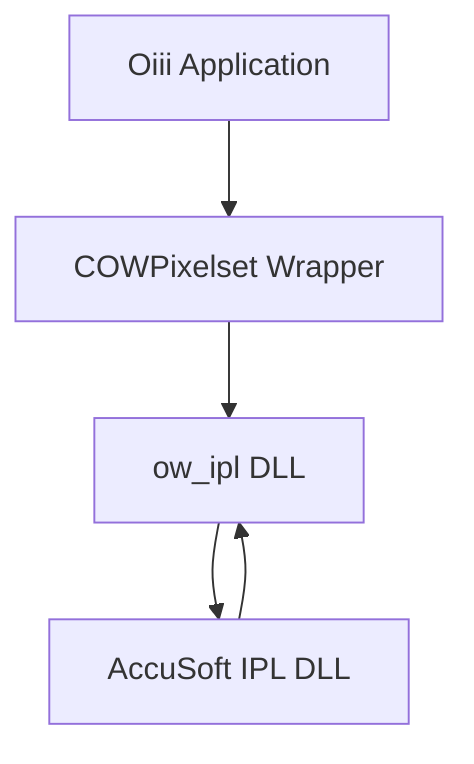

# Image Loading and Processing via AccuSoft – Color, Palette, and Filter Operations

This section describes how **Oiii** leverages the AccuSoft Pro Imaging Toolkit (IPL) through the **ow_ipl** and **ow_iff** integration for advanced color conversions, palette management, and filter operations. These routines enable pre-processing, enhancement, and visualization of pixel, segment, and image data before analysis.

## Color Conversions 🎨

AccuSoft’s color space routines support conversions between RGB, CMYK, HSL, IHS, and more.

- **color_RGB_to_CMYK** converts an RGB triple to CMYK.
- **color_CMYK_to_RGB** reverses CMYK to RGB.
- You can install custom black-generation (BG) and under-color removal (UCR) functions via **color_CMYK_BG_func_install** and **color_CMYK_UCR_func_install**.

| Function | Purpose | Bit Depth |
| --- | --- | --- |
| color_RGB_to_CMYK(lpRGB, lpCMYK) | RGB → CMYK conversion | 24-bit |
| color_CMYK_to_RGB(lpCMYK, lpRGB) | CMYK → RGB conversion | 24-bit |
| color_CMYK_BG_func_install(func) | Install custom black-generation callback | All supported |
| color_CMYK_UCR_func_install(func) | Install under-color removal (UCR) callback | All supported |
| color_RGB_to_HSL(lpRGB, lpHSL) | RGB → HSL conversion | 24-bit |
| color_HSL_to_RGB(lpHSL, lpRGB) | HSL → RGB conversion | 24-bit |


```cpp
// Convert a pixel from RGB to CMYK
RGBQUAD rgb = {255, 128, 64};
CMYK    cmyk;
color_RGB_to_CMYK(&rgb, &cmyk);
```

## Palette Management 🖌️

Palettes map indexed-color images to RGB triples. AccuSoft offers routines to query and modify palettes, enabling pseudocolor visualizations or highlighting.

| Function | Description |
| --- | --- |
| palette_get(lpPalette, n, lpEntry, idx) | Retrieve one palette entry at index `idx` |
| palette_set(lpPalette, n, lpRGB, idx) | Set one entry at index `idx` |
| palette_get_range(lpPalette, n, lpArray, s, e) | Retrieve entries from `s` to `e` |
| palette_set_range(lpPalette, n, lpArray, s, e) | Set entries from `s` to `e` from an RGB array |
| palette_set_range_k(lpPalette, n, lpRGB, s, e) | Set entries between `s` and `e` to one RGB value |
| palette_is_gray(lpPalette, n) | Detect if palette is grayscale |


```cpp
// Create a gradient palette from blue to red
RGBQUAD ramp[256];
for(int i=0; i<256; ++i) {
    ramp[i].rgbRed   = i;
    ramp[i].rgbGreen = 0;
    ramp[i].rgbBlue  = 255 - i;
}
palette_set_range(palette, 256, ramp, 0, 255);
```

## Filter Operations 🏗️

AccuSoft provides high-performance image filters for edge detection, sharpening, smoothing, and more. Oiii calls these via **ow_ipl** to enhance image data prior to analysis.

### Edge Detection Filters

- **filter_edge_map_Roberts** computes the Roberts cross-gradient.
- **filter_edge_map_Sobel** applies the Sobel operator.
- **filter_edge_map_Prewitt** uses the Prewitt operator.

All require 8-bit or 24-bit images and an ROI handle.

```cpp
// Generate a Sobel edge map on the full image
filter_edge_map_Sobel(ipImage, roi);
```

(Edge detectors are incompatible with palette-indexed images.)

### Sharpening

- **filter_sharpen(image, roi, w, h, gain, mode)** increases edge contrast using a convolution kernel.
- `mode` controls intensity or per-channel processing.

### Smoothing (Examples)

- **filter_smooth_Gaussian** applies a Gaussian blur.
- **filter_smooth_average_rect** and **filter_smooth_average_circle** perform mean-value smoothing.

## Integration in Oiii

The **COWPixelset** class encapsulates AccuSoft image buffers and IPL handles. It supports conversion between:

- **DIB** (Windows BMP)
- **IplImage*** (OpenCV style)
- **IFF** (AccuSoft internal format)

Fields:

```cpp
IplImage*        m_pIplImage;    // IPL image buffer
int              m_imghandle;    // IFF handle
int              m_ipl_image;    // IPL handle 
BITMAPINFOHEADER m_tempBIH;      // DIB header
```

### Component Interaction



- **Oiii Application** invokes methods on **COWPixelset**.
- **COWPixelset** routes calls to **ow_ipl**, which wraps AccuSoft IPL routines.
- **ow_iff** handles image‐file I/O and format support alongside **ow_ipl**.

---