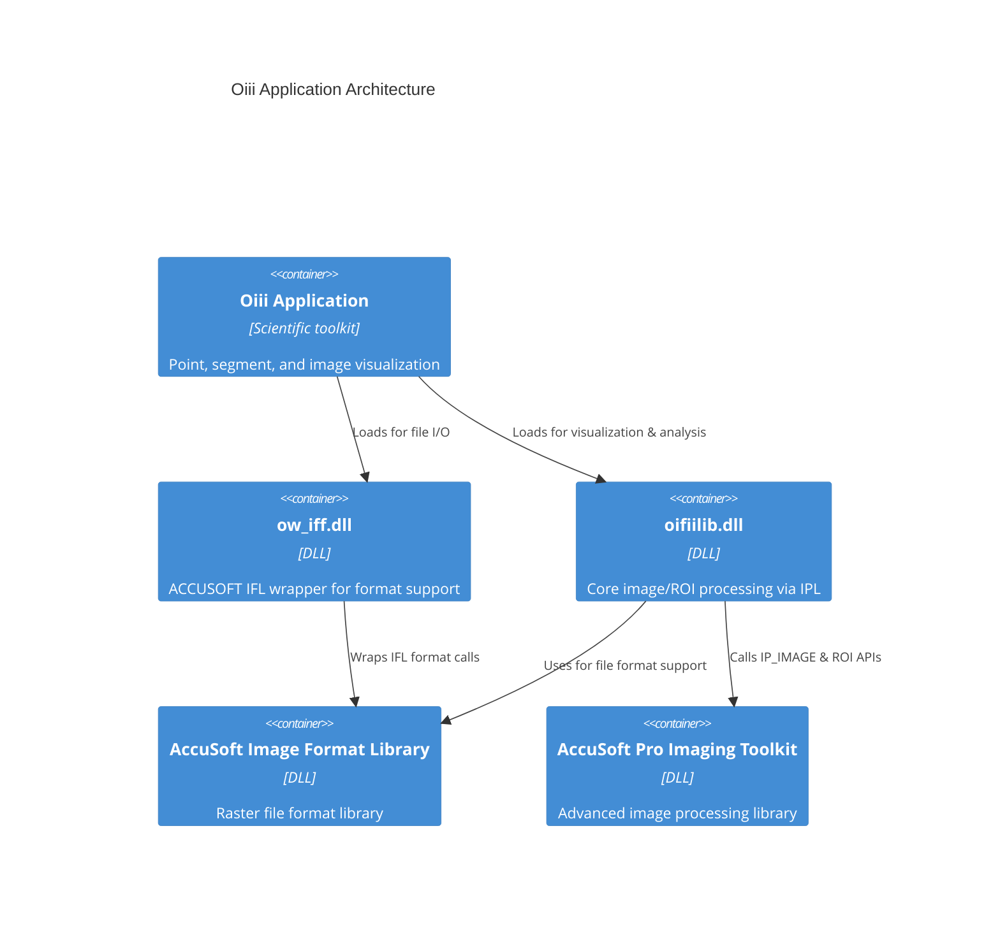

# Image Loading and Processing via AccuSoft – Overview of AccuSoft Integration

Oiii leverages AccuSoft’s Image Format Library (IFL) and Pro Imaging Toolkit (IPL) to provide robust raster image I/O and advanced image processing. Through two primary components—**ow_iff.dll** and **oifiilib.dll**—the application reads/writes dozens of formats and applies ROI-based filters, histograms, and color conversions.

## Integration Layers

- **ow_iff.dll**

Wraps AccuSoft IFL calls to load and save raster formats.

- **oifiilib.dll**

Wraps AccuSoft IPL routines for pixel- and ROI-based processing.

- **AccuSoft Image Format Library (IFL)**

A DLL supporting 36+ raster file formats for read/write operations.

- **AccuSoft Pro Imaging Toolkit (IPL)**

A DLL offering DIB access, ROI handling, histogram analysis, filtering, and color conversion APIs.

## Dependency Mapping

| Component | Linked Library | Role |
| --- | --- | --- |
| ow_iff.dll | accuimr5.lib | Raster file I/O via IFL |
| oifiilib.dll | accupwr1.lib, accuimr5.lib | ROI and pixel processing via IPL and IFL |


The Visual Studio project file for `ow_iff.dll` specifies linking against `accuimr5.lib` for format support .

## Core Data Structures & APIs

### IP_IMAGE

A handle representing an image in IPL.

- Allocate/free:

```cpp
  IP_IMAGE img = ip_image_alloc();       // Allocate IP_IMAGE 
  ip_image_free(img);                    // Free IP_IMAGE 
```

- Associate with a DIB:

```cpp
  ip_image_associate((LPBMIH)&bih, img); // Link DIB header to IP_IMAGE 
```

### IP_ROI

Defines a region-of-interest for targeted processing.

- Allocation & clipping:

```cpp
  IP_ROI roi = ROI_alloc(ROI_SEGMENTS);   // Allocate ROI 
  ROI_clip_rect_set(roi, &rect);         // Set clip rectangle
  ROI_free(roi);                         // Free ROI 
```

### DIB (BITMAPINFOHEADER)

Windows Device-Independent Bitmap header for raw pixel access. IPL uses DIB pointers for optimized memory management.

## File Format Support

- **Read dimensions**:

```cpp
  DIB_file_read_dimension("img.png", &w, &h, &bpp, TRUE);
```

- **Read image**:

```cpp
  HDIB hDIB = DIB_file_read("img.tif", &bih, w, h, bpp, TRUE);  // → returns handle 
  LPBMIH lpBIH = DIB_lock(hDIB);
```

- **Save image**:

```cpp
  OW_IFF_IMG_save_bitmap(imghandle, "out.bmp", FORMAT_BMP);  // ow_iff.dll export 
```

## Pixel & ROI Access Routines

| Category | Example APIs |
| --- | --- |
| **Single-pixel** | pix_get, pix_set, pix_get_from_palette, pix_set_from_palette |
| **Row access** | row1_get, row1_set, row24_get, row24_set |
| **Column access** | col8_get, col24_set_k, line_get, line_set_k |
| **ROI segments** | ROI_first_segment_get, ROI_next_segment_get |


## Image Processing Routines

- **Arithmetic & blending**:

```cpp
  arith(src1, src2, dst, roi, ARITH_ADD);              // Pixel arithmetic 
  blend_with_LUTs(dst, roi, src, lut1, lut2, MODE, out, key);
```

- **Edge detection**:

```cpp
  filter_edge_map_Roberts(img, roi);                   // Roberts edge 
  filter_edge_map_Sobel(img, roi);                     // Sobel edge 
```

- **Morphological filters**:

```cpp
  morph_dilate(img, roi, width, height);               // Dilation 
  morph_erode(img, roi, width, height);                // Erosion
```

- **Resampling & transforms**: IPL’s `iplResize`, `iplZoom`, `xform_gamma_correct`, `xform_arith_one_image` for geometric and intensity transformations.

## Color Space Conversion

- **RGB↔HSL**:

```cpp
  color_RGB_to_HSL(&rgb, &hsl);
  color_HSL_to_RGB(&hsl, &rgb);                        // 8-bit conversion 
```

- **RGB↔IHS, YIQ, CMYK, XYZ, Lab**:

Extensive suite of functions for device-independent conversions.

## Usage Example

```cpp
// 1. Read a BMP into an IP_IMAGE
HDIB      hDIB = DIB_file_read("input.bmp", &bih, width, height, bpp, TRUE);
LPBMIH    lpBIH = DIB_lock(hDIB);
IP_IMAGE  img   = ip_image_alloc();
ip_image_associate(lpBIH, img);

// 2. Define ROI and process
IP_ROI roi = ROI_alloc(ROI_SEGMENTS);
ROI_clip_rect_set(roi, &bih.bmiHeader.rcBounds);
filter_edge_map_Sobel(img, roi);

// 3. Cleanup
ROI_free(roi);
ip_image_free(img);
DIB_unlock(hDIB);
DIB_free(hDIB);
```

## C4 Component Diagram



## Best Practice 📌

```card
{
    "title": "Resource Cleanup",
    "content": "Always free IP_IMAGE and ROI handles with ip_image_free and ROI_free to avoid memory leaks."
}
```

This layered integration ensures Oiii can read/write a wide range of raster formats, associate pixel and point sets with underlying DIB images, and apply powerful AccuSoft ROI and histogram APIs in higher-level visualizations.