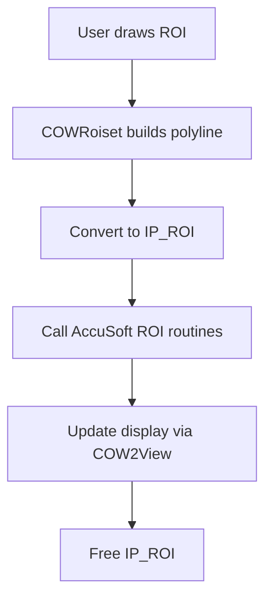

# Image Loading and Processing via AccuSoft – ROI Handling with AccuSoft

The AccuSoft Pro Imaging Toolkit provides a rich set of **ROI (Region of Interest)** routines to allocate, manipulate, and process arbitrary regions within images. In Oiii, these low-level functions underpin ROI-based workflows, offering efficient subimage processing while the application’s own `COWRoiset` and view classes manage user interaction and drawing.

---

## ROI Lifecycle

Manage the lifetime and basic transformations of an ROI handle.

| Function | Purpose |
| --- | --- |
| **ROI_alloc** | Allocate a new ROI of a given shape and size |
| **ROI_free** | Release resources associated with an ROI handle |
| **ROI_lock** | Lock internal memory for safe pixel access |
| **ROI_unlock** | Unlock after pixel operations complete |
| **ROI_move** | Translate ROI by a vector `(dx, dy)` |
| **ROI_copy** | Duplicate one ROI to another |


```c
IP_ROI roi = NULL;
ROI_alloc(&roi, ROI_TYPE_SEGMENTS);    // Allocate
// ... set up ROI geometry ...
ROI_lock(roi);
//  Perform pixel-level processing...
ROI_unlock(roi);
ROI_move(roi, &deltaPoint);            // Translate
ROI_free(roi);                         // Clean up
```

> ⭐️ All lifecycle functions are prefixed `ROI_` and use the `ACCUAPI` calling convention .

---

## Geometric Operations

Perform set operations or rotations on ROIs without touching the image data.

| Function | Description |
| --- | --- |
| **ROI_union** | Compute union of two ROIs |
| **ROI_intersect** | Compute intersection of two ROIs |
| **ROI_clip_rect_set / get** | Set or retrieve the clipping rectangle for segment output |
| **rotate_roi_any_angle** | Rotate ROI by an arbitrary angle into a destination image |
| **rotate_roi_multiple_of_90** | Rotate ROI by 0°, 90°, 180°, or 270° |


```c
// Rotate a specific subregion by 45° with bilinear interpolation
BOOL success = rotate_roi_any_angle(
    dstImage, srcImage, roi, 45.0,
    ROTATE_BILINEAR, NULL, NULL
);
```

> ✂️ Clipped ROI pixels fill outside areas with an RGB color if provided .

---

## Segment-Level Access

Iterate over one-dimensional segments that compose an ROI, and manipulate rows or individual pixels.

| Function | Role |
| --- | --- |
| **ROI_number_of_segments** | Query total segments in the ROI |
| **ROI_first_segment_get** | Retrieve the first segment; initializes internal counter |
| **ROI_next_segment_get** | Retrieve subsequent segments until exhausted |
| **ROI_max_segment_length** | Get the longest segment’s length |
| **row_set_k / row_get** | Write or read a row of pixels within the current segment |


```c
WORD segCount = ROI_number_of_segments(roi);
SEGMENT seg;
ROI_first_segment_get(roi, &seg);
for (WORD i = 0; i < segCount; ++i) {
    // Process pixels from seg.x to seg.x + seg.length on seg.y
    row_set_k(image, &seg, &pixelValue);
    ROI_next_segment_get(roi, &seg);
}
```

> 🔍 Segment routines invoke any registered status-bar callback for progress updates .

---

## Status Bar Callbacks & Statistics

Provide live feedback and compute ROI metrics.

- **ROI_status_bar_callback_register**: Register a function to receive progress updates
- **ROI_status_bar_update**: Manually trigger a status-bar refresh
- **ROI_statistics_get**: Compute min, max, mean, and standard deviation over ROI pixels

```c
// Register and use an update callback
ROI_status_bar_callback_register(roi, MyStatusBarFunc, NULL);
ProcessImageWithROI(image, roi);
ROI_statistics_get(image, roi, &stats);
```

> 📊 Statistics routines read all segments and aggregate values, allowing Oiii to display ROI histograms and info.

---

## Integration in Oiii

1. **User Interaction**
2. `COWRoiset` captures mouse-drawn polygons and builds vector shapes.
3. On commit, polygons convert to IP_ROI handles via `poly_to_ROI`.

1. **Processing Pipeline**
2. Oiii passes the `IP_ROI` to AccuSoft routines for subimage operations (filters, transforms).
3. Toolkit functions operate only on the ROI, leaving the rest of the image untouched.

1. **Visualization**
2. After processing, `COWRoiset` and `COW2View` classes render ROI boundaries and overlays.



> 💡 By leveraging AccuSoft’s C API for ROI, Oiii achieves high-performance subimage processing while offering intuitive vector-based ROI editing.

---

**Key Takeaways**

```card
{
    "title": "Why Use AccuSoft ROI",
    "content": "Offers efficient hardware-optimized ROI processing and seamless integration in Win32 C/C++ applications."
}
```

```card
{
    "title": "Oiii ROI Layer",
    "content": "Separates user-facing vector ROI from low-level pixel routines for clean architecture."
}
```