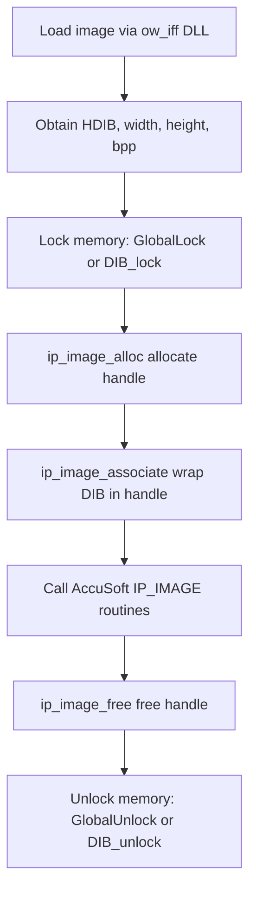

# Image Loading and Processing via AccuSoft – Understanding DIB and IP_IMAGE Structures

This section explains how the Oifii toolkit integrates with the AccuSoft Pro Imaging Toolkit to load, wrap, and process Windows Device Independent Bitmaps (DIBs) via the internal `IP_IMAGE` handle. You’ll learn about the DIB memory layout, the `IP_IMAGE` abstraction, and the sequence Oiii follows to prepare images for AccuSoft routines.

## Device Independent Bitmap (DIB) Format

Windows DIBs store bitmaps in a self-describing format. Key components:

- **BITMAPINFOHEADER**: Describes image dimensions and color depth.
- **Palette (optional)**: For ≤8-bit images, an array of `RGBQUAD` entries (blue, green, red, unused).
- **Bitmap data**: Pixel array, oriented bottom-up by default.

| Field | Description |
| --- | --- |
| `biWidth` | Image width in pixels |
| `biHeight` | Image height in pixels |
| `biBitCount` | Bits per pixel (1, 4, 8, 24) |
| **Palette** | Present if `biBitCount` ≤ 8; array of `RGBQUAD` entries |
| **Pixel array** | Stored bottom-up: first scanline is image bottom |


The AccuSoft toolkit honors the DIB standard but internally re-orients pixel access to top-left origin for consistency with most processing algorithms .

## Pixel Data Orientation

Although DIBs use bottom-up scanlines (origin at lower-left), most Oifii pixel routines assume a top-left origin. The toolkit’s access functions invert row order automatically:

- **Standard routines**: Treat row 0 as top of image.
- **AOI_ functions**: Read/write regions of interest bottom-up to support the Windows clipboard convention .

## IP_IMAGE: The AccuSoft Handle

Instead of operating directly on raw `BITMAPINFOHEADER*`, AccuSoft wraps DIBs in an **opaque** `IP_IMAGE` handle. This internal structure caches metadata for efficient processing.

**Key characteristics:**

- Treated as a handle; callers never pass its address.
- Remains valid only while the DIB remains locked.
- Must be freed immediately after DIB unlock to avoid stale pointers.

### Lifecycle Functions

| Function | Purpose | Notes |
| --- | --- | --- |
| `IP_IMAGE ip_image_alloc(void)` | Allocate an empty `IP_IMAGE` handle | Returns < 0 on failure |
| `void ip_image_associate(const LPBMIH, IP_IMAGE)` | Initialize handle from locked DIB pointer | Use after `GlobalLock` / `DIB_lock` |
| `void ip_image_free(IP_IMAGE)` | Free handle and internal memory | Do **not** call after unlocking DIB |


```c
/* Example: wrap a Windows DIB in an IP_IMAGE handle */
LPBITMAPINFOHEADER lpBMIH = (LPBITMAPINFOHEADER)GlobalLock(hDIB);
IP_IMAGE            image  = ip_image_alloc();
if (image >= 0) {
    ip_image_associate(lpBMIH, image);
    /* … perform AccuSoft processing on image … */
    ip_image_free(image);
}
GlobalUnlock(hDIB);
```

## 🚀 Workflow: Wrapping a DIB for AccuSoft Processing



1. **Load** image buffer via `OW_IFF_IMG_bitmap_info`.
2. **Lock** the DIB: `GlobalLock(hDIB)` or `DIB_lock(hDIB)`.
3. **Allocate** `IP_IMAGE`: `ip_image_alloc()`.
4. **Associate** DIB pointer: `ip_image_associate(lpBMIH, image)`.
5. **Process** with AccuSoft routines (e.g., `arith`, `blend`).
6. **Free** handle: `ip_image_free(image)`.
7. **Unlock** DIB: `GlobalUnlock(hDIB)` or `DIB_unlock(hDIB)` .

## Integration in COWPixelset

Within `**COWPixelset**`, Oiii bridges its own buffers and AccuSoft handles:

```cpp
HANDLE hDIB = OW_IFF_IMG_bitmap_info(m_imghandle, &width, &height, &bits_per_pixel);
BITMAPINFOHEADER* pBIH = (BITMAPINFOHEADER*)GlobalLock(hDIB);
int              result = AllocBII(pBIH);
GlobalUnlock(hDIB);
```

- `AllocBII(BITMAPINFOHEADER*)` invokes:
- `ip_image_alloc()`
- `ip_image_associate()`
- Toolkit conversion into Oifii’s band-interleaved buffer
- Ensures any AccuSoft-processed buffer is wrapped/unwrapped correctly .

---

**Best Practice:** Always match each `ip_image_alloc`/`ip_image_associate` pair with a corresponding `ip_image_free` *before* unlocking the DIB to prevent invalid memory access.