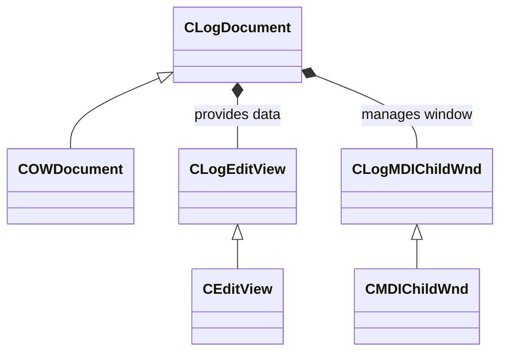

# Troubleshooting and Logging – Logging Mechanisms

Oiii features a dedicated **logging system** to aid diagnostics and monitor long-running operations. It uses an MFC document/view architecture to capture, display, and persist textual messages. Below we detail the key components, their responsibilities, and how they integrate into Oiii.

## Components

- **CLogDocument**

Manages the in-memory log buffer and optional file output.

- **CLogEditView**

Renders the log buffer in a read-only edit control within an MDI child.

- **CLogMDIChildWnd**

Hosts the log view as an MDI child window, handling sizing and background.

| Component | Files | Purpose |
| --- | --- | --- |
| CLogDocument | LOGDOC.H, LOGDOC.CPP | Buffering, saving, and controlling log output |
| CLogEditView | LOGVIEW.H, LOGVIEW.CPP | Displaying log text with automatic scrolling |
| CLogMDIChildWnd | LOGMDI.H, LOGMDI.CPP | Windowing support for the log edit view |


## CLogDocument

`CLogDocument` extends `COWDocument` to collect and persist log messages.

Responsibilities:

- **Buffer** messages in `m_BufferString`.
- **File output** to `log.txt` when enabled.
- **View notifications** when text is added.

```cpp
// LOGDOC.H excerpt
class OIFIILIB_API CLogDocument : public COWDocument
{
  CString m_BufferString;
  BOOL    m_bEnableLog;
  // ...
public:
  CLogDocument();
  ~CLogDocument();
  void AddTextW(LPCTSTR lpszString);
  void AddText(LPCSTR lpszString);
  void ClearAllText();
  void EnableLog();
  void DisableLog();
  void EnableViewUpdating();
  void DisableViewUpdating();
  void EnableFileUpdating();
  void DisableFileUpdating();
  // ...
};
```

**Key methods**

- `AddTextW` / `AddText`: Append Unicode or ANSI text.
- `EnableLog` / `DisableLog`: Toggle logging on/off.
- `EnableViewUpdating` / `DisableViewUpdating`: Control view refresh.
- `EnableFileUpdating` / `DisableFileUpdating`: Control file writes.

## CLogEditView

`CLogEditView` subclasses `CEditView` to render the document’s buffer.

Behavior:

- Read-only text.
- Auto-scroll to the latest entry.
- Custom **Clear** command to wipe the buffer.

```cpp
// LOGVIEW.CPP excerpt
IMPLEMENT_DYNCREATE(CLogEditView, CEditView)
BEGIN_MESSAGE_MAP(CLogEditView, CEditView)
  ON_COMMAND(ID_EDIT_CLEAR, OnEditClear)
  ON_UPDATE_COMMAND_UI(ID_EDIT_CLEAR, OnUpdateEditClear)
END_MESSAGE_MAP()

void CLogEditView::OnInitialUpdate() {
  CView::OnInitialUpdate();
  GetEditCtrl().SetReadOnly(TRUE);
  // Set font and initial text...
}

void CLogEditView::OnUpdate(CView*, LPARAM, CObject*) {
  CLogDocument* pDoc = (CLogDocument*)GetDocument();
  GetEditCtrl().SetWindowText(pDoc->m_BufferString);
  // Scroll to bottom...
}
```

**Clear command** always enabled to reset logs.

## CLogMDIChildWnd

`CLogMDIChildWnd` customizes the MDI child frame for log views.

Features:

- Black background with white text.
- Resizing logic to fill client area.

```cpp
// LOGMDI.H excerpt
class OIFIILIB_API CLogMDIChildWnd : public CMDIChildWnd {
  BOOL PreCreateWindow(CREATESTRUCT& cs);
  afx_msg void OnSize(UINT, int cx, int cy);
  afx_msg HBRUSH OnCtlColor(CDC*, CWnd*, UINT);
  afx_msg BOOL OnEraseBkgnd(CDC*);
};
```

**Message handlers** set control colors and manage layout.

## Logging Operations

- **Appending text**

```cpp
  ((COIIIApp*)AfxGetApp())->GetLogDocument()->AddTextW(L"Operation started\r\n");
```

- **Toggling logs**

```cpp
  GetLogDocument()->EnableLog();
  GetLogDocument()->DisableLog();
```

- **File vs. view updates**

```cpp
  GetLogDocument()->EnableFileUpdating();
  GetLogDocument()->DisableViewUpdating();
```

| Operation | Method | Default |
| --- | --- | --- |
| Append Unicode text | AddTextW | Enabled |
| Append ANSI text | AddText | Enabled |
| Enable in-memory logging | EnableLog | On |
| Disable in-memory logging | DisableLog | Off |
| Enable view refresh | EnableViewUpdating | On |
| Disable view refresh | DisableViewUpdating | Off |
| Enable file writes | EnableFileUpdating | Off |
| Disable file writes | DisableFileUpdating | Off |


## Integrating Logs in Library Routines

During segmentation, mesh validation, and flood-fill, optional debug code logs issues to **CLogDocument** under `_DEBUG`.

```cpp
// In FindAllTriSurroundingVertex() – on error:
ASSERT(FALSE);
#ifdef _DEBUG
  CLogDocument* pLog = ((COIIIApp*)AfxGetApp())->GetLogDocument();
  CString myString;
  myString.Format("Error in FindAllTriSurroundingVertex(), cannot find valid tri for vertex %d\r\n", ivertex);
  pLog->AddText(myString);
#endif
return -99;
```

This helps trace invalid triangles or non-convex configurations during runtime.

### User-Aborted Operations

Long-running builds (e.g., fusion-tree flood-fill) can be **aborted by pressing ESC**. The loop logs an “aborted by user” message:

```cpp
if (PeekKeyState(VK_ESCAPE)) {
  CString msg;
  msg.Format(L"\r\nOEBREdgeFill() aborted by user after collecting %d triangles\r\n", count);
  GetLogDocument()->AddTextW(msg);
  return count;
}
```

This provides immediate feedback when complex edge-fills are cancelled.

## Monitoring Logs at Runtime

End users open the **Log** window from the View menu. They can:

- **Watch progress** of segmentation or geometry builds.
- **Inspect failures** when invalid mesh elements are encountered.
- **Save** the log via File → Save As for offline analysis.

Use the **Clear** button to start fresh sessions.

## Class Diagram



This diagram highlights the MFC inheritance and composition relationships between logging components.

## Tips & Best Practices

```card
{
    "title": "Enable Conditional Logging",
    "content": "Wrap log calls in _DEBUG so release builds skip diagnostic overhead."
}
```

- **Avoid flooding** the log with high-frequency loops; use `DisableViewUpdating` during tight loops.
- **Persist logs** only when needed via `EnableFileUpdating`.
- **Clear logs** between major tasks to isolate issues.

With this setup, Oiii’s logging mechanisms provide a robust framework for diagnosing geometric algorithms, monitoring long-running operations, and guiding end users through troubleshooting.