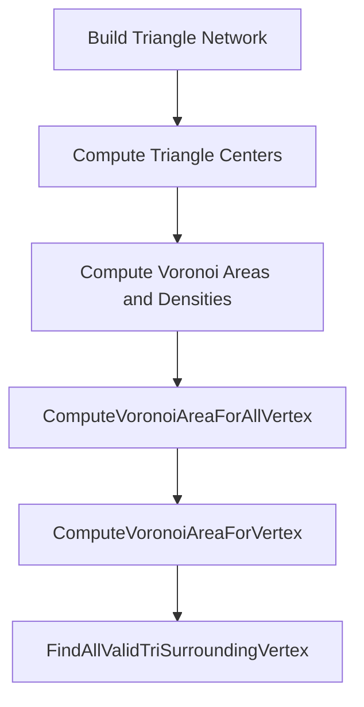

# Using Analysis and Visualization Features – Computing Voronoi Areas and Densities

This section describes how the POINTSET library computes Voronoi areas and densities for point‐based analyses. These metrics serve as fundamental inputs for color‐mapping, spatial segmentation, and neighborhood‐based statistics.

## Workflow 🔍

The Voronoi computation follows a three‐stage pipeline:



1. Build an in‐memory triangulation of input points.
2. Compute the centroid of each triangle (these become Voronoi cell vertices).
3. Compute per‐vertex Voronoi area and density.

## Key Data Structures

POINTSET stores all data required for Voronoi computations in a single structure:

| Field | Description |
| --- | --- |
| `px[]`, `py[]` | Arrays of X/Y coordinates for each point. |
| `ctx[]`, `cty[]` | Arrays of X/Y coordinates for each triangle center. |
| `pfStatistics[]` | Flattened array storing per‐vertex statistics. |
| `nStatPerPoint` | Number of double values allocated per vertex in `pfStatistics`. |
| `npts` | Total number of points (vertices). |


## Core Functions

Below is an overview of the main APIs used:

| Function | Signature | Purpose |
| --- | --- | --- |
| **ComputeVoronoiAreaForAllVertex** | `int ComputeVoronoiAreaForAllVertex(POINTSET* pPointset);` | Iterates all vertices, invoking per‐vertex area/density computation |
| **ComputeVoronoiAreaForVertex** | `int ComputeVoronoiAreaForVertex(POINTSET* pPointset, int id);` | Builds Voronoi cell around a single vertex and accumulates area/density |
| **FindAllValidTriSurroundingVertex** | `int FindAllValidTriSurroundingVertex(POINTSET*, int, int*, int*, int*, int*);` | Gathers triangle indices and neighbors fully surrounding a vertex |


## ComputeVoronoiAreaForAllVertex

**ComputeVoronoiAreaForAllVertex** initializes a loop over every vertex:

```cpp
int ComputeVoronoiAreaForAllVertex(POINTSET* pPointset) {
    for (int idv = 0; idv < pPointset->npts; idv++) {
        ComputeVoronoiAreaForVertex(pPointset, idv);
    }
    return TRUE;
}
```

- Logs debug messages at start and end if `pFILE_debug` is set.
- Ensures each point’s Voronoi metrics are computed .

## ComputeVoronoiAreaForVertex

**ComputeVoronoiAreaForVertex** executes the core algorithm for a single vertex:

```cpp
int ComputeVoronoiAreaForVertex(POINTSET* pPointset, int idvertex) {
    // 1. Find surrounding triangles and neighbors
    if (FindAllValidTriSurroundingVertex(
            pPointset, idvertex,
            &itriseed, &numTriangles,
            triArray, &numNeighbors, neighborArray)) {
        // 2. Close the polygon (append first triangle)
        triArray[numTriangles] = triArray[0];
        // 3. Decompose into triangles and sum areas
        for (int j = 1; j <= numTriangles; j++) {
            // Compute triangle area via shoelace formula
            fTriangleArea = /* ... */;
            fVoronoiArea += fTriangleArea;
        }
    } else {
        fVoronoiArea = POINTSET_TAGFORINVALIDVOROAREA;
    }
    // 4. Store area and density
    pPointset->pfStatistics[idvertex * pPointset->nStatPerPoint
        + POINTSET_OFFSETSTAT_VOROAREA] = fVoronoiArea;
    fVoronoiDensity = (fVoronoiArea > 0)
        ? 1.0 / fVoronoiArea
        : POINTSET_TAGFORINVALIDVOROAREA;
    pPointset->pfStatistics[idvertex * pPointset->nStatPerPoint
        + POINTSET_OFFSETSTAT_VORODENSITY] = fVoronoiDensity;
    return TRUE;
}
```

Steps:

- **FindAllValidTriSurroundingVertex** gathers all fully valid adjacent triangles .
- **Close the polygon** by repeating the first triangle center.
- **Triangle decomposition** uses the shoelace formula to accumulate total cell area.
- **Density calculation** is simply the inverse of area, with invalid or boundary cases tagged as `-9999.99` .

## Integration with Visualization 📊

Once Voronoi areas and densities are stored in `pfStatistics`, they drive color‐mapping and derived analyses:

```cpp
for (int i = 0; i < pPointset->npts; i++) {
    double density = pPointset->pfStatistics[
        i * pPointset->nStatPerPoint + POINTSET_OFFSETSTAT_VORODENSITY];
    setColorByDensity(density);
    drawVertex(pPointset->px[i], pPointset->py[i]);
}
```

- **Color mapping** scales each vertex by its density.
- **Segmentation** algorithms often use these metrics for local thresholding.

## Best Practices

- Always call **ComputeAllTriangleCenters** before Voronoi computations.
- Use **NormalizeAllVertex** to scale results between desired display ranges.
- Handle invalid tags (`POINTSET_TAGFORINVALIDVOROAREA`) when performing neighborhood averages or variance analyses.
- For smoothed density fields, apply **ComputeLocalAverage** with appropriate neighbor orders after computing densities.

This suite of functions provides a robust foundation for spatial analysis and intuitive visualization of point‐based datasets.