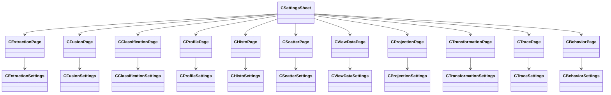

# Using Analysis and Visualization Features

Oiii exposes a rich set of configurable analysis domains via its **Settings** menu and dialogs. Each domain maps to a property page backed by a settings class, which in turn drives operations over the `POINTSET` and `SEGMENTSET` libraries, as well as AccuSoft image-processing routines.

## ⚙️ Configuring Analysis Settings

The **Settings** menu provides access to dialogs for tuning extraction, profiling, histograms, scatter plots, fusion, classification, data mapping, projection, transformation, trace, and mouse behavior. Under the hood, the `CSettingsSheet` creates one property page per domain, each paired with a `CObject`-derived settings class .

```cpp
// Inside COIIIApp InitInstance:
m_pExtractionSettings     = new CExtractionSettings;
m_pFusionSettings         = new CFusionSettings;
m_pClassificationSettings = new CClassificationSettings;
m_pProfileSettings        = new CProfileSettings;
m_pHistoSettings          = new CHistoSettings;
m_pScatterSettings        = new CScatterSettings;
m_pViewDataSettings       = new CViewDataSettings;
m_pProjectionSettings     = new CProjectionSettings;
m_pTransformationSettings = new CTransformationSettings;
m_pTraceSettings          = new CTraceSettings;
m_pBehaviorSettings       = new CBehaviorSettings;
```

### Extraction and Profiling of Data Values

The **Extraction** page lets you select texture- and shape-based features to compute across points or pixels. Its settings class captures thresholds, scales, and feature flags :

| Field | Description |
| --- | --- |
| bTCDbyLocalMax | Use local maxima detection |
| iTCDThreshold, iTCDScale | Threshold value and scale for detection |
| bTCCArea, bTCCDensity | Compute area or density feature |
| bTCCAverageIntensity | Include average intensity |
| (… and more class flags) | Roads, man-made, forestation, deforestation |


The **Profile** page defines line or neighbor-based profiling parameters via `CProfileSettings` :

- `bImagePixels` / `bImageFeatures`: select pixel vs. feature profile
- `iNeighborOrder`: radius for neighbor-based statistics
- `idchannelStat`: choose statistic channel from pointset or segmentset
- `bAutoScale`: automatically scale the resulting profile

### Histogram Computation and Display

The **Histogram** page controls global or local histogram parameters using `CHistoSettings` . It mirrors profile settings with additional auto-scale flags. Once configured, Oiii invokes:

```cpp
BOOL CHistogram::MapStatChannelIntoHisto(
    COW2Doc*      pOW2Doc,
    int           iPointType,          // HISTO_IMAGEPIXELS or HISTO_POINTSET
    int           iPointCollectionType,// INTERIOR, BOUNDARY, etc.
    int           idROI,
    int           idVertex,
    int           iNumNeighbor,
    int           idSegment,
    int           iStatChannel,        // statistic channel index
    int           iNumberOfLevel       // number of histogram bins
);
```

Internally, `MapStatisticsVectorIntoHistogram` builds a bar graph via the AccuSoft toolkit and `COWGraphDoc` . The histogram view draws axes, grid, and bars in `CHistogramView` (HISTOVW.CPP).

### Scatter Plot Views

The **Scatter graph** page uses `CScatterSettings` to select two statistic channels and sampling parameters . Update calls funnel into:

```cpp
BOOL CScatterGraph::Update(
    COW2Doc* pDoc,
    int      iPointType,
    int      iPointCollectionType,
    int      idROI,
    int      idVertex,
    int      iNumNeighbor,
    int      idSegment,
    int      idStatChan1,
    int      idStatChan2
);
```

Data series are added to `COWGraphDoc`, and plotted by `CScatterGraphView` in OWGRAPH.CPP, handling scaling and rendering of points or crosses .

### Fusion and Classification Parameters

The **Fusion** page exposes parameters that guide segment merging through `CFusionSettings` :

| Field | Purpose |
| --- | --- |
| bSegTypeHSO / bSegTypeHRG / Mixed | Choose segmentation similarity criterion |
| idstatchannelUsedAsSimilarityCriteria | Statistic channel for computing similarity |
| bUseExclusionThreshold | Enable threshold exclusion for merge candidates |
| fExclusionThreshold | Threshold value |
| bUsePreClassificationInfo | Include pre-class assignment in merging |
| idstatchannelUsedAsPreClassificationInfo | Preclassification statistic channel index |


These settings drive the C API `BuildFusionTree(SEGMENTSET*)`, which repeatedly calls `GetBestMatchingSegmentPair` and `MergeSegmentPair` to assemble a hierarchical segmentation .

The **Classification** page uses `CClassificationSettings` for supervised vs. unsupervised modes . Under the hood, `BuildClassFusionTree(SEGMENTSET*)` applies similar routines to merge segments into classes.

### Projection and Transformation Parameters

Spatial mapping and coordinate transforms are tuned on the **Projection** and **Transformation** pages:

- `CProjectionSettings` defines view volume (`fVVSLeft`, `fVVSTop`, …), near/far planes, and camera “look-at” vectors .
- `CTransformationSettings` holds viewport translation (`fVTX`, `fVTY`), model-transform translate/scale/rotate parameters, and flags for absolute vs. relative application .

These map to OpenGL or AccuSoft IPL calls for skew, stretch, rotation, and perspective projection (e.g., `skew_using_two_points`, `skew_with_disp_array`) in the AccuSoft Image Format Library .

### Data Mapping and View Settings

The **Mapping** page controls which overlays render in 3D views via `CViewDataSettings` :

- Booleans for drawing pixelset, pointset, triangleset, voronoiset, segmentset
- Label toggles for points, triangles, segments, classes
- Z-offsets and ranges for layering
- `idstatchannelMappedToTriHeight`: map statistic to triangle extrusion height

Settings apply in `COW2View::OnDraw` when iterating edgesets and glyphs.

---

## Settings Architecture Diagram



This diagram illustrates how the **Settings** sheet composes individual pages, each paired with a distinct settings class. By adjusting these properties, users can fine-tune data extraction, visualization, and analysis workflows across Oiii’s point, segment, and image processing pipeline.