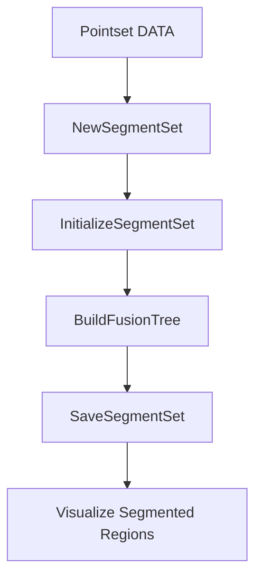

# Using Analysis and Visualization Features – Segmentation and Fusion Tree Analysis

This section describes how Oiii’s **SEGMENTSET** library powers texture‐based segmentation and hierarchical fusion operations, and how the desktop UI triggers, monitors, and visualizes these analyses.

---

## Workflow Overview

Oiii performs segmentation on a point set by:

- Allocating a `SEGMENTSET` structure.
- Initializing segments with statistics and neighbor relationships.
- Iteratively merging the most similar segment pairs to build a fusion tree.
- Saving the final segmentation data for visualization.



---

## SEGMENTSET Library

The **SEGMENTSET** library (in `segmentset.h`/`.cpp`) encapsulates core mechanics for segmentation:

| Component | Purpose |
| --- | --- |
| **NewSegmentSet** | Allocate structures for initial + fusion segments. |
| **InitializeSegmentSet** | Build per‐segment statistics and neighbor lists. |
| **BuildFusionTree** | Merge segments until target count, recording each fusion. |


### InitializeSegmentSet

Constructs per‐segment data from a `POINTSET`:

```cpp
// Build segment stats, neighbor lists, and best‐match criteria
void InitializeSegmentSet(
    SEGMENTSET* pSegmentSet,
    POINTSET*   pPointset
);
```

Key steps:

- **InitializeSegmentStatistics**: Copy and validate feature statistics.
- **InitializeListNeighbor**: Build lists of adjacent segments.
- **InitializeBestMatchingNeighborSegment**: Compute each segment’s best‐match neighbor and merge criterion.

### BuildFusionTree

Performs hierarchical merging to reduce segments from the initial count to the final target:

```cpp
// Iteratively merge best‐matching segment pairs
void BuildFusionTree(
    SEGMENTSET* pSegmentSet
);
```

Workflow:

1. Set `iActualNumberOfSegment = iInitialNumberOfSegment`.
2. Loop `idsegNewParent` from start to final:
3. Find best pair:

```cpp
     int idseg1 = GetBestMatchingSegmentPair(pSegmentSet);
     int idseg2 = pSegment1->idsegBestMatchingSegment;
```

- Merge via `MergeSegmentPair`, update counts.
- Record fusion in `pListFusion`.

---

## UI Integration

Oiii’s document class (`COW2Doc`) exposes a menu command to run segmentation:

```cpp
void COW2Doc::OnAnalysisTexturesegmentation() {
    CLogDocument* pLog = ((COIIIApp*)AfxGetApp())->GetLogDocument();
    pLog->AddText("Will now perform texture segmentation\r\n");

    // 1) Allocate segmentset
    pLog->AddText(" allocating segmentset . ");
    m_pSegmentset = NewSegmentSet(
        m_pPointset->GetNumberOfPoints(),
        m_pPointset->GetNumberOfPoints()*2 - 1
    );
    pLog->AddText("done.\r\n");

    // 2) Initialize from pointset
    pLog->AddText(" initializing segmentset from pointset . ");
    InitializeSegmentSet(m_pSegmentset, m_pPointset->m_pPOINTSET);
    pLog->AddText("done.\r\n");

    // 3) Build fusion tree
    pLog->AddText(" building fusion tree . ");
    BuildFusionTree(m_pSegmentset);
    pLog->AddText("done.\r\n");

    // 4) Save to disk
    pLog->AddText(" saving segmentset to disk . ");
    SaveSegmentSet(m_pSegmentset, GetPathName().GetString());
    pLog->AddText("done.\r\n");

    pLog->AddText("Texture segmentation successfully terminated\r\n");
}
```

Steps exposed to the user:

- **Run** segmentation in one command.
- **Progress** logged to the LOGDOC window.
- **Save** outputs: `.set`, `.seg`, `.nei`, `.fus` files.

### Aborting Long Runs

While building the fusion tree, users can abort via the ESC key. On each merge iteration:

```cpp
// Inside BuildFusionTree loop:
BOOL bEsc = ((COIIIApp*)AfxGetApp())->PeekKeyState(VK_ESCAPE);
if(bEsc) {
    CString msg;
    msg.Format(
      "\r\nBuildFusionTree() aborted by user after merging %d segments\r\n",
      idsegNewParent - iStart
    );
    ((COIIIApp*)AfxGetApp())->GetLogDocument()->AddText(msg);
    return;
}
```

- **Keyboard check** interrupts long operations.
- **Abort message** logged with count of merges performed.

---

## Visualization of Segmented Regions

After fusion, Oiii visualizes partitions by tracing segment boundaries:

- **Edge Extraction**:
- `CollectAllSegmentEdge` gathers edges for a segment.
- `GetEdgeFrontierLineCoor` computes line coordinates for drawing.
- **Partition Views**:
- `COWPartitionset` and `COWFusionset` classes (derived from `COWEdgeset`) feed view renderers.
- **Statistics Display**:
- Segment statistics (size, criteria) support classification and analysis.

Key API prototypes in `c_segmentset.h`:

```cpp
// Retrieve a list of final‐partition segment IDs
int GetRemainingSegmentListForFinalPartition(
    SEGMENTSET* pSegmentSet,
    int*        pidsegList,
    int         finalCount
);

// Draw frontier lines between segments
BOOL GetEdgeFrontierLineCoor(
    POINTSET* pPointset,
    EDGE      myEdge,
    POINT2DD* p1,
    POINT2DD* p2
);
```

---

## Summary

By integrating the **SEGMENTSET** library, Oiii delivers a robust segmentation and fusion workflow:

- **Efficient** structure allocation and initialization.
- **Hierarchical** merging driven by statistical criteria.
- **Interactive** UI with logging and abort capabilities.
- **Rich** visualization through edge extraction and partition views.

These features enable deep analysis of image‐derived point sets and empower users to explore multi‐scale clustering patterns effectively.