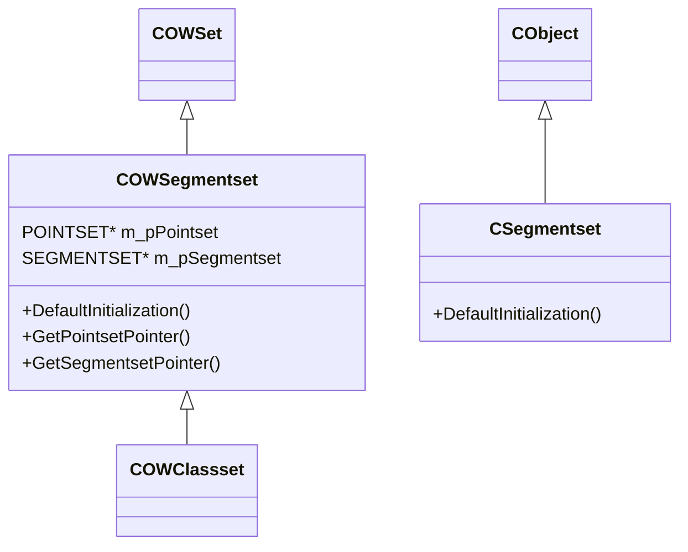

# oifiilib Core Libraries (POINTSET and SEGMENTSET) – C++ Wrappers: COWSegmentset and Friends

oifiilib provides C++ wrappers around its core C libraries for **point-based** and **segment-based** processing. These wrappers simplify memory management and offer seamless integration with the MFC document/view framework used by the Oiii.exe application.

## 🤖 COWSegmentset

`COWSegmentset` encapsulates the C structures **POINTSET** and **SEGMENTSET**, managing their lifetimes and exposing safe accessors.

```cpp
// owsegmentset.h
class OIFIILIB_API COWSegmentset : public COWSet {
protected:
    POINTSET*    m_pPointset;
    SEGMENTSET*  m_pSegmentset;
public:
    COWSegmentset();
    ~COWSegmentset();
    void DefaultInitialization();
    POINTSET* GetPointsetPointer();
    SEGMENTSET* GetSegmentsetPointer();
};
```

Key responsibilities:

- **Initialization**

Sets both pointers to `NULL`, avoiding dangling references.

- **Destruction**

Calls `DeletePointset` and `DeleteSegmentSet` to free resources safely.

- **Accessors**

Provide raw pointers for downstream algorithms, e.g. segmentation and fusion.

### Method Summary

| Method | Return Type | Description |
| --- | --- | --- |
| `DefaultInitialization()` | `void` | Sets `m_pPointset` and `m_pSegmentset` to `NULL`. |
| `GetPointsetPointer()` | `POINTSET*` | Returns pointer to the underlying **POINTSET**. |
| `GetSegmentsetPointer()` | `SEGMENTSET*` | Returns pointer to the underlying **SEGMENTSET**. |
| `COWSegmentset()` | — | Constructor; calls `DefaultInitialization()`. |
| `~COWSegmentset()` | — | Destructor; frees both C structures if non-null. |


## 🗂 CSegmentset

`CSegmentset` wraps `COWSegmentset` functionality into an MFC `CObject`-derived class. It enables:

- **Serialization** via MFC archiving
- **Document/View integration** for UI commands
- **DefaultInitialization** stub to align with other wrappers

```cpp
// owsegmentset.h
class OIFIILIB_API CSegmentset : public CObject {
public:
    CSegmentset();
    ~CSegmentset();
    void DefaultInitialization();
};
```

## Unified API via oifiilib.h

The central header **oifiilib.h** pulls together all C++ wrappers into a single include:

- **OWpointset** – wraps `POINTSET` C API
- **OWsegmentset** – wraps `SEGMENTSET` C API (i.e. `COWSegmentset`)
- **OWclassset** – wraps classification structures derived from `SEGMENTSET`
- **OWedgeset** – wraps edge/shape primitives

This design gives Oiii a **unified API** for geometric and topological data, hiding low-level memory details from application code.

## Architecture and Relationships



This diagram shows:

- **Inheritance** – `COWSegmentset` extends a generic `COWSet`, while `CSegmentset` derives from `CObject`.
- **Composition** – `COWSegmentset` holds raw C data pointers.

## Usage Pattern in Oiii

1. **Construction**

The application creates a `COWSegmentset` instance, which initializes its pointers.

1. **Allocation**

Calls to `NewSegmentSet` allocate the underlying C `SEGMENTSET`.

1. **Initialization**

`InitializeSegmentSet` populates segment lists based on a `POINTSET`.

1. **Visualization**

MFC views retrieve data via `CSegmentset` for on-screen rendering.

These wrappers ensure safe memory handling and provide a clear, high-level interface for complex segmentation tasks.

## 📌 Key Takeaways

```card
{
    "title": "Abstraction Benefit",
    "content": "Wrappers manage C memory and expose simple methods to C++ application code."
}
```

- **Separation of Concerns** – application code never calls low-level C APIs directly.
- **Memory Safety** – destructors handle cleanup automatically.
- **UI Integration** – `CSegmentset` enables serialization and UI binding in the document/view framework.