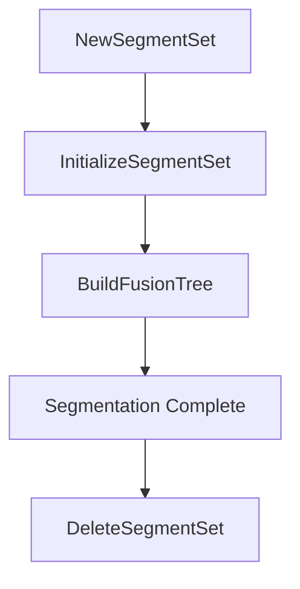

# SEGMENTSET Library Overview

The **SEGMENTSET** library provides core routines to perform hierarchical segmentation on point-based data. It manages segment structures, neighbor relationships, and a history-aware fusion tree that records every merge operation. This enables dynamic exploration of segmentation stages within the Oiii environment.

## Data Structures

### SEGMENTSET

This central structure holds all data for a segmentation process:

| Field | Type | Description |
| --- | --- | --- |
| pListSegment | `SEGMENT*` | Array of all segments (initial + fused) |
| pListNeighbor | `int*` | Flat list of neighbor segment IDs |
| pListFusion | `FUSION*` | Sequence of fusion records |
| pfStatistics | `double*` | Per-segment statistics buffer |
| nStatPerSegment | `int` | Number of statistics per segment |
| nSizeStatInByte | `int` | Byte size of the statistics buffer |
| iInitialNumberOfSegment | `int` | Count of original segments |
| iFinalNumberOfSegment | `int` | Maximum segments after all merges |
| iActualNumberOfSegment | `int` | Current segment count |
| iActualNumberOfNeighbor | `int` | Allocated size of neighbor list |
| iActualNumberOfFusion | `int` | Allocated size of fusion list |
| idneiNextAvailNeighbor | `int` | Next free slot in `pListNeighbor` |
| iTotalNumberOfByteUsed | `int` | Memory footprint tracker |


Defined in **c_segmentset.h** .

### SEGMENT

Each **SEGMENT** tracks metadata for a region:

```c
typedef struct tagSEGMENT {
  int idsegParentSegment;      // Parent segment ID (-1 if root)
  int iNumberOfSegment;        // Sub-segments count (initially 1)
  int idsegBestMatchingSegment;// Best neighbor for potential merge
  int idneiFirstNeighbor;      // Index into pListNeighbor
  int iNumberOfNeighbor;       // How many neighbors follow
  double fBestMatchValue;      // Merge criterion value
} SEGMENT;
```

### NEIGHBOR

A **NEIGHBOR** entry is simply a segment ID:

```c
typedef int NEIGHBOR;  // ID into pListSegment
```

List resizing and access are managed via:

- `InitializeListNeighbor()`
- `ReallocListNeighbor()`
- `MergeNeighborList()`
- `GetPointerToNeighbor()`

Defined in **neighbor.h** .

### FUSION

Records each merge operation in the fusion tree:

```c
typedef struct tagFUSION {
  int idsegChildSegment1;    // First child segment ID
  int idsegChildSegment2;    // Second child segment ID
  double fCriteria;          // Criterion at merge time
} FUSION;
```

Key functions:

- `MergeSegmentPair()`
- `RegisterFusion()`
- `GetPointerToFusion()`

Defined in **fusion.h** .

---

## Allocation & Cleanup

### NewSegmentSet

Allocate and configure a **SEGMENTSET** for `initialnumberofsegment` up to `finalnumberofsegment`:

```c
SEGMENTSET* NewSegmentSet(int initialnumberofsegment,
                          int finalnumberofsegment);
```

- Validates parameters (`final ≤ 2*initial - 1`).
- Allocates arrays: segments, neighbor list (approx. 20×initial), fusion list.
- Initializes memory-usage counter.

Reference implementation .

### DeleteSegmentSet 🧹

Frees all internal buffers and the SEGMENTSET itself:

```c
void DeleteSegmentSet(SEGMENTSET* pSegmentSet);
```

- `free(pListFusion)`
- `free(pListNeighbor)`
- `free(pListSegment)`
- `free(pfStatistics)` (if allocated)
- `free(pSegmentSet)`

Implemented in **segset.mc** .

---

## Initialization

### InitializeSegmentSet

Prepares segmentation state from an existing **POINTSET**:

```c
void InitializeSegmentSet(SEGMENTSET* pSegmentSet,
                          POINTSET*    pPointset);
```

Performs three key steps:

1. **Statistics**: `InitializeSegmentStatistics()` populates `pfStatistics`, sets each segment’s parent to itself, `iNumberOfSegment = 1`.
2. **Neighbors**: `InitializeListNeighbor()` builds adjacency lists from Delaunay/TIN topology.
3. **Best Matches**: `InitializeBestMatchingNeighborSegment()` computes each segment’s best neighbor and merge criterion.

---

## Fusion Tree Construction

### BuildFusionTree

Iteratively merges segments until reaching `iFinalNumberOfSegment`:

```c
void BuildFusionTree(SEGMENTSET* pSegmentSet);
```

Workflow:

1. Set `iActualNumberOfSegment = iInitialNumberOfSegment`.
2. Loop `idsegNewParent` from start to final ID:
3. Find best pair: `GetBestMatchingSegmentPair()`.
4. Perform merge: `MergeSegmentPair(pSegmentSet, idsegNewParent, idseg1, idseg2)`.
5. Increment `iActualNumberOfSegment`.
6. Fusion history recorded in `pListFusion`.



---

## Integration & Usage

Within **Oiii.exe**, segmentation is invoked in `COW2Doc::OnAnalysisTexturesegmentation()`:

```cpp
m_pSegmentset = NewSegmentSet(npts, npts*2-1);
InitializeSegmentSet(m_pSegmentset, m_pPointset->m_pPOINTSET);
BuildFusionTree(m_pSegmentset);
SaveSegmentSet(m_pSegmentset, path);
```

Debug dumps aid development:

- `DumpInfoSegmentSetToFile()`
- `DumpInfoSegmentToFile()`
- `DumpInfoFusionToFile()`

---

## Dependencies & Relationships

- **POINTSET**: supplies geometric primitives and per-point statistics.
- **SEGMENT**: fundamental unit, tracks region growth and neighbors.
- **NEIGHBOR**: adjacency representation linking segments.
- **FUSION**: ordered history of merges enabling temporal navigation.
- **File I/O**: `OpenSegmentSet()` / `SaveSegmentSet()` serialize state to disk.

This layered design ensures separation of concerns: **POINTSET** handles raw geometry; **SEGMENTSET** builds on it to perform segmentation; **FUSION** captures merge history for interactive exploration.

---

```card
{
    "title": "Memory Footprint",
    "content": "SEGMENTSET tracks total allocated bytes in iTotalNumberOfByteUsed."
}
```

```card
{
    "title": "Merge Criterion",
    "content": "Use fBestMatchValue to prioritize which segments to fuse first."
}
```

> Card examples highlight best practices and considerations.