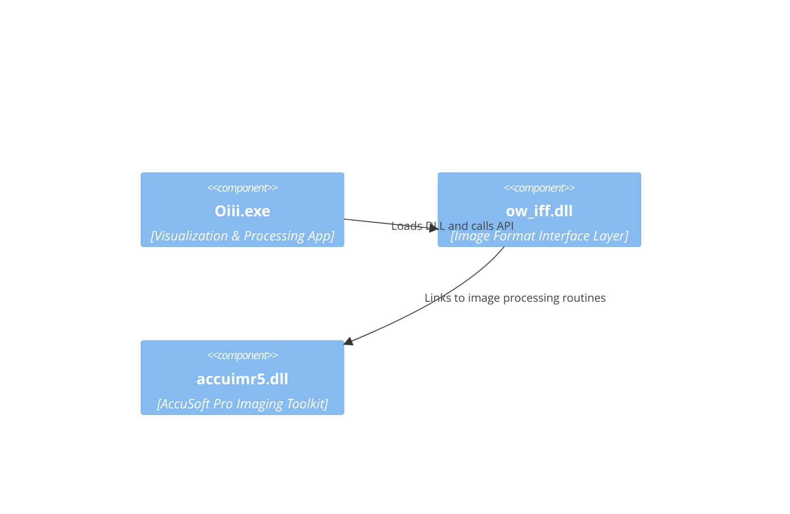

# ow_iff DLL and Image Format Support – Build Configuration and Dependencies

This section explains how the **ow_iff** DLL is configured and built, and details its dependencies. The **ow_iff** library provides an interface layer between the **Oiii.exe** application’s geometric/visualization environment and low-level image format handling routines powered by the AccuSoft Pro Imaging Toolkit.

---

## 🔧 Build Configuration Flags

The **ow_iff** project uses different compiler and linker settings for **Release** and **Debug** configurations. In **Release** builds, it:

- **Links** against the **static** C runtime (`/MT`).
- **Optimizes** for speed (`/O2`).
- Defines preprocessor symbols: `WIN32`, `NDEBUG`, `_WINDOWS`, `_MBCS`, `_USRDLL`, and `OW_IFF_EXPORTS`.

| Flag | Description |
| --- | --- |
| `/MT` | Static multi-threaded runtime |
| `/O2` | Optimize for maximum speed |
| `/W3` | Warning level 3 |
| `/GX` | Enable exception handling |
| `/D NDEBUG` | Disable debug-only code |


```make
# Example compiler flags from the NMake makefile
ADD BASE CPP /nologo /MT /W3 /GX /O2 \
    /D "WIN32" /D "NDEBUG" /D "_WINDOWS" \
    /D "_MBCS" /D "_USRDLL" /D "OW_IFF_EXPORTS" \
    /Yu"stdafx.h" /FD /c

```

---

## ⚙️ Standard Windows Libraries

The **ow_iff** DLL links against the core Windows subsystem libraries to support file I/O, GUI, OLE/COM, and database connectivity:

| Library | Purpose |
| --- | --- |
| kernel32.lib | Core OS functions (threads, memory, I/O) |
| user32.lib | Window management and messaging |
| gdi32.lib | Graphics Device Interface |
| winspool.lib | Printer spooler API |
| comdlg32.lib | Common dialogs (Open, Save As, Print) |
| advapi32.lib | Registry and advanced Windows services |
| shell32.lib | Shell API (file operations, drag-drop) |
| ole32.lib | COM library |
| oleaut32.lib | COM Automation support |
| uuid.lib | GUID generation and manipulation |
| odbc32.lib | ODBC database connectivity |
| odbccp32.lib | ODBC installer support |


```bash
# Link command snippet for Debug build
link.exe @C:\WINDOWS\TEMP\RSP30A4.TMP

# Contents of RSP30A4.TMP:
kernel32.lib user32.lib gdi32.lib winspool.lib comdlg32.lib \
advapi32.lib shell32.lib ole32.lib oleaut32.lib uuid.lib \
odbc32.lib odbccp32.lib accuimr5.lib /nologo /dll \
/incremental:yes /pdb:"Debug/ow_iff.pdb" /debug \
/machine:I386 /out:"Debug/ow_iff.dll" \
/implib:"Debug/ow_iff.lib" .\Debug\ow_iff.obj .\Debug\StdAfx.obj

```

---

## 📦 AccuSoft Imaging Library

To handle a wide range of image formats and perform advanced processing, **ow_iff** links against AccuSoft’s Pro Imaging Toolkit libraries:

| Library | Role |
| --- | --- |
| accuimr5.lib | Image format support and processing routines |


```xml
<!-- AdditionalDependencies in ow_iff.vcproj -->
<AdditionalDependencies>
  odbc32.lib; odbccp32.lib; accuimr5.lib; %(AdditionalDependencies)
</AdditionalDependencies>

```

---

## 🛠️ Example Linker Command (Release)

```bash
# Release build invocation
link.exe @C:\DOCUME~1\…\Temp\RSP18.tmp

# RSP18.tmp contents:
kernel32.lib user32.lib gdi32.lib winspool.lib comdlg32.lib \
advapi32.lib shell32.lib ole32.lib oleaut32.lib uuid.lib \
odbc32.lib odbccp32.lib accuimr5.lib /nologo /dll \
/incremental:no /pdb:"Release/ow_iff.pdb" /machine:I386 \
/out:"Release/ow_iff.dll" /implib:"Release/ow_iff.lib" \
".\Release\ow_iff.obj" ".\Release\StdAfx.obj"

```

---

## 📊 Dependency Diagram



---

## 🚀 Summary

The **ow_iff** DLL acts as the bridge between **Oiii.exe** and low-level image handling routines. Its **Release** configuration uses static runtime linking and aggressive optimization flags to maximize performance. By linking both standard Windows libraries and AccuSoft’s imaging libraries, **ow_iff** ensures robust support for diverse image formats within the Oiii scientific visualization environment.