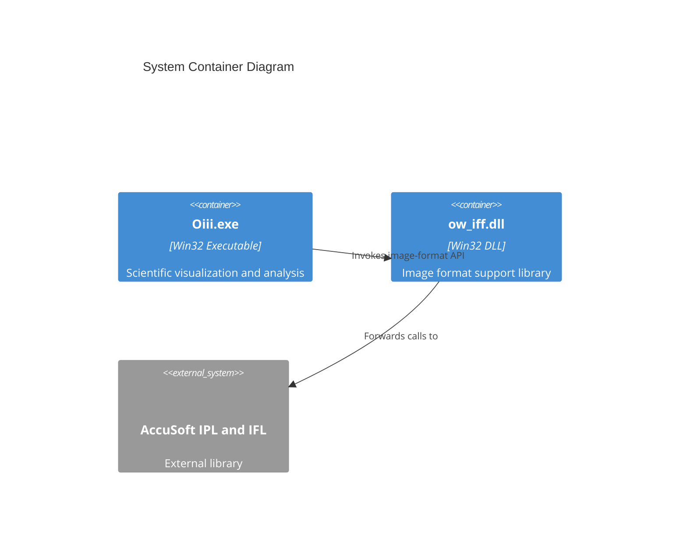

# ow_iff DLL and Image Format Support

This section describes the **ow_iff** Win32 dynamic-link library project, which exposes image-format functionality to the Oiii desktop application and other clients. It wraps calls to the AccuSoft Pro Imaging Toolkit and Image Format Library, providing a unified API for loading, querying, displaying, and saving raster images.

---

## 🛠 ow_iff Project Purpose

The **ow_iff** project delivers a lightweight DLL that:

- Acts as an adapter between Oiii.exe and the AccuSoft imaging libraries
- Simplifies image format handling (e.g., BMP, TIFF, JPEG, GIF)
- Exposes high-level functions for loading, querying, manipulating, and saving bitmaps

### Key Objectives

- **Modularity**: Isolate image-format logic in a single DLL
- **Compatibility**: Support legacy Win32 (x86) environments
- **Reusability**: Allow other applications to leverage the same API

---

## ⚙️ Project Configuration

| Configuration | Platform | Preprocessor Definitions | Output DLL | Import Library |
| --- | --- | --- | --- | --- |
| **ow_iff – Win32 Release** | Win32 | WIN32;NDEBUG;_WINDOWS;_USRDLL;OW_IFF_EXPORTS | `ow_iff.dll` | `ow_iff.lib` |
| **ow_iff – Win32 Debug** | Win32 | WIN32;_DEBUG;_WINDOWS;_USRDLL;OW_IFF_EXPORTS | `ow_iff.dll` | `ow_iff.lib` |


### Precompiled Headers

> Build settings and linker dependencies (e.g., `odbc32.lib`, `odbccp32.lib`, `accuimr5.lib`) are defined in the Visual C++ project configurations .

To accelerate compilation, **ow_iff** uses a precompiled header:

```cpp
// StdAfx.h
#pragma once
#include <windows.h>
// Insert rarely-changed system or library headers here
```

- Generated PCH file: `ow_iff.pch`
- Source: `StdAfx.cpp`

---

## 🚪 Export Macros

All public symbols are annotated with **OW_IFF_API**, defined in `ow_iff.h`:

```cpp
#ifdef OW_IFF_EXPORTS
  #define OW_IFF_API __declspec(dllexport)
#else
  #define OW_IFF_API __declspec(dllimport)
#endif
```

This ensures:

- Building **ow_iff.dll** exports the API (when `OW_IFF_EXPORTS` is defined)
- Client projects importing the header see correct `dllimport` declarations

```card
{
    "title": "Export Macro",
    "content": "Define OW_IFF_EXPORTS when building the DLL; consumer projects should omit it."
}
```

---

## 📦 Exposed API

Below is a selection of core functions exported by **ow_iff.dll**. All functions use the **ACCUAPI** calling convention and wrap underlying AccuSoft calls.

```cpp
// Example exports from ow_iff.h
OW_IFF_API int    ACCUAPI OW_IFF_IMGLOW_get_filetype(char FAR* filename);
OW_IFF_API int    ACCUAPI OW_IFF_IMGLOW_get_pages(char FAR* filename);
OW_IFF_API HGLOBAL ACCUAPI OW_IFF_IMG_bitmap_info(
    int imghandle, int FAR* width, int FAR* height, int FAR* bits_per_pixel
);
OW_IFF_API HBITMAP ACCUAPI OW_IFF_IMG_dib_to_ddb(
    int imghandle, int width, int height
);
OW_IFF_API int    ACCUAPI OW_IFF_IMG_decompress_bitmap(char FAR* filename);
OW_IFF_API int    ACCUAPI OW_IFF_IMG_save_bitmap(
    int imghandle, char FAR* filename, int type
);
```

For a full list, see **ow_iff.h** .

---

## 🔗 Integration with Oiii.exe

The **Oiii** application links against **ow_iff.lib** and includes its headers:

- **Include path**: Adds `..\ow_iff` to **AdditionalIncludeDirectories**
- **Linker dependencies**:
- Debug Win32: `.\ow_iff\Debug\ow_iff.lib`
- Release Win32: `.\ow_iff\Release\ow_iff.lib`

This enables direct calls like:

```cpp
int type = OW_IFF_IMGLOW_get_filetype("image.tif");
```

---

## 🏗️ Architecture Overview



This component diagram highlights how **Oiii.exe** delegates all image-format operations to **ow_iff.dll**, which in turn calls the AccuSoft libraries.

---

## 🔍 Summary

- **ow_iff** centralizes image-format handling, easing maintenance
- Configured for **Win32 (x86)** with **Debug** and **Release** modes
- Exports a clear C API for common operations (load, query, display, save)
- Relies on **AccuSoft Pro Imaging Toolkit** for low-level image processing

By encapsulating these functions, **ow_iff** simplifies Oiii’s code and enables potential reuse in other Win32 applications.